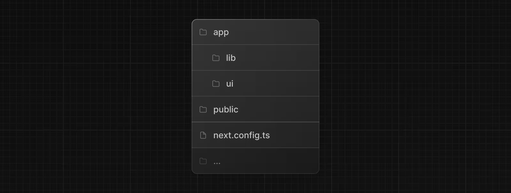
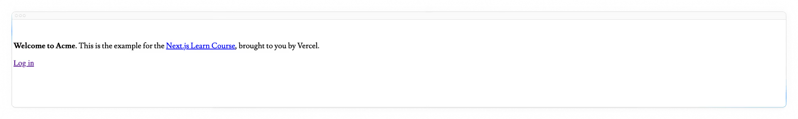

# 入门指南

## 创建一个新项目

我们推荐使用 [pnpm](https://pnpm.io/) 作为你的包管理器，因为它比 npm 或 yarn 更快、更高效。如果你还没有安装 pnpm，可以通过运行以下命令进行全局安装：

```bash
npm install -g pnpm
```

要创建一个 Next.js 应用，请打开终端，切换到你想存放项目的文件夹，然后运行以下命令：

```bash
npx create-next-app@latest nextjs-dashboard --example "https://github.com/vercel/next-learn/tree/main/dashboard/starter-example" --use-pnpm
```

此命令使用 [`create-next-app`](https://nextjs.org/docs/app/api-reference/cli/create-next-app)，这是一个命令行界面（CLI）工具，可为你搭建 Next.js 应用程序。在上面的命令中，你还结合本课程的 [入门示例](https://github.com/vercel/next-learn/tree/main/dashboard/starter-example) 使用了 `--example` 标志。

## 探索这个项目

与那些让你从头开始编写代码的教程不同，本课程的大部分代码都已经为你写好了。这更能反映现实世界中的开发情况，在实际开发中，你很可能要处理现有的代码库。

我们的目标是帮助你专注于学习 Next.j 的主要功能，而无需编写所有的应用程序代码。

安装完成后，在你的代码编辑器中打开项目，并导航至 `nextjs-dashboard`。

```bash
cd nextjs-dashboard
```

让我们花些时间来探索这个项目。

### 文件夹结构

你会注意到这个项目有以下文件夹结构：



- `/app`: 包含应用程序的所有路由、组件和逻辑，这是你主要的工作区域。
- `/app/lib/`: 包含应用程序中使用的函数，例如可复用的实用工具函数和数据获取函数。
- `/app/ui/`: 包含您应用程序的所有用户界面组件，例如卡片、表格和表单。为节省时间，我们已经为这些组件预先设置了样式。
- `/public`: 包含应用程序的所有静态资源，例如图片。
- `Config Files`: 你还会注意到配置文件，例如应用程序根目录下的 `next.config.ts`。这些文件中的大多数都是在你使用 `create-next-app` 创建新项目时自动创建并预先配置好的。在本课程中，你无需修改它们。

尽管探索这些文件夹吧，如果你现在还不理解代码的所有作用，也不用担心。

### 占位符数据

在构建用户界面时，使用一些占位数据会有所帮助。如果数据库或应用程序接口（API）尚未可用，你可以：

- 使用 JSON 格式或 JavaScript 对象中的占位符数据。
- 使用第三方服务，如 [mockAPI](https://mockapi.io/)

在这个项目中，我们在 `app/lib/placeholder-data.ts`中提供了一些占位数据。该文件中的每个 JavaScript 对象都代表数据库中的一个表。例如，对于 invoices 表:

```TypeScript
// /app/lib/placeholder-data.ts

const invoices = [
  {
    customer_id: customers[0].id,
    amount: 15795,
    status: "pending",
    date: "2022-12-06",
  },
  {
    customer_id: customers[1].id,
    amount: 20348,
    status: "pending",
    date: "2022-11-14",
  },
  // ...
];
```

在[第六章](./第六章.md)中，你将使用这些数据来初始化数据库（即向其中填充一些初始数据）。

### TypeScript

你可能还会注意到大多数文件都带有 `.ts` 或 `.tsx` 后缀。这是因为该项目是用 TypeScript 编写的。我们希望打造一门能反映现代网络格局的课程。

如果你不懂 TypeScript 也没关系 —— 我们会在需要的时候提供 TypeScript 代码片段。

目前，先看一下 `/app/lib/definitions.ts` 文件。在这里，我们手动定义将从数据库返回的类型。例如，invoices 表有以下类型：

```TypeScript
// /app/lib/definitions.ts

export type Invoice = {
  id: string;
  customer_id: string;
  amount: number;
  date: string;
  // In TypeScript, this is called a string union type.
  // It means that the "status" property can only be one of the two strings: 'pending' or 'paid'.
  status: 'pending' | 'paid';
};
```

通过使用 TypeScript，你可以确保不会意外地向组件或数据库传递错误的数据格式，比如向`amount` 传递 `number` 而不是 `string`。

> **如果你是一名TypeScript开发者：**
>
> - 我们正在手动声明数据类型，但为了更好的类型安全性，我们建议 [Prisma](https://www.prisma.io/) 或 [Drizzle](https://orm.drizzle.team/) ,它会根据你的数据库模式自动生成类型。
> - Next.js会检测你的项目是否使用TypeScript，并自动安装必要的包和配置。Next.js 还为你的代码编辑器配备了一个 [TypeScript plugin](https://nextjs.org/docs/app/api-reference/config/typescript#typescript-plugin)
>   ，以助力实现自动补全和类型安全。

## 运行开发服务器

运行 `pnpm i` 来安装项目的包。

```bash
pnpm i
```

然后运行 `pnpm dev` 来启动开发服务器。

```bash
pnpm dev
```

`pnpm dev` 会在 `3000` 端口启动你的 Next.js 开发服务器。让我们检查一下它是否正常运行。

在浏览器中打开 [http://localhost:3000](http://localhost:3000) 。你的主页应该是这个样子的，它特意没有添加样式：


[下一章](./第二章.md)
