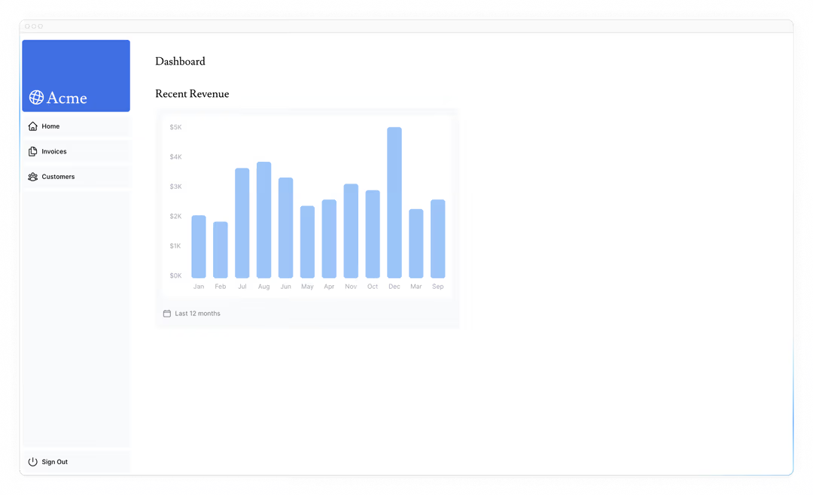
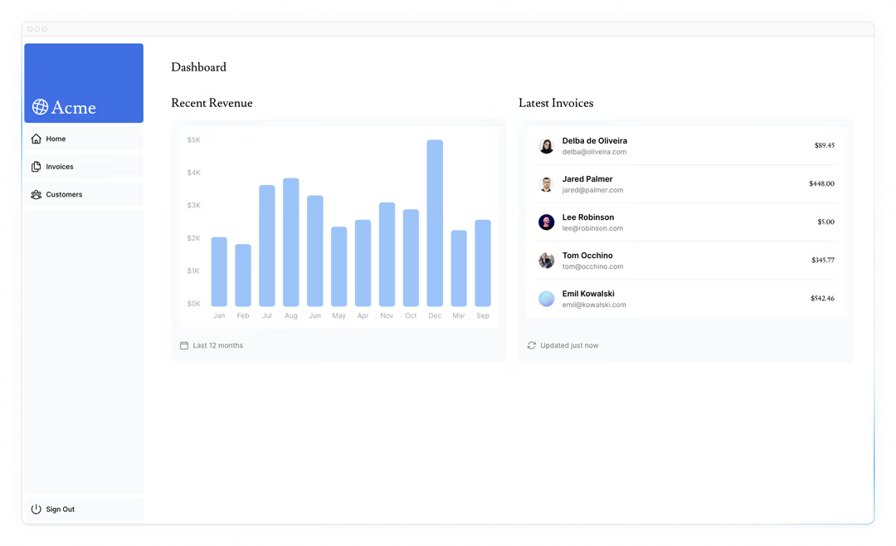
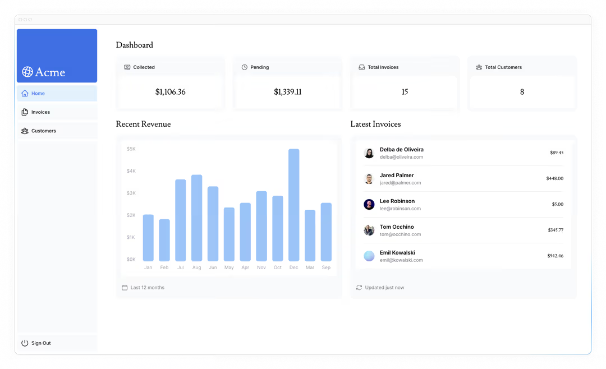
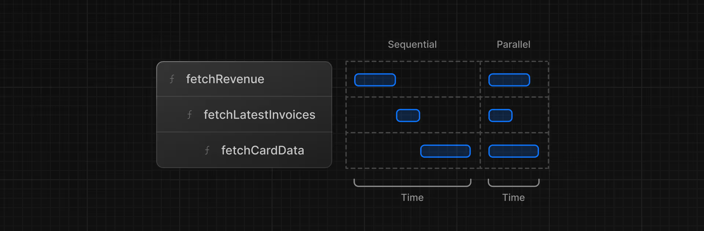

# 获取数据

既然你已经创建并填充了数据库，接下来让我们讨论为应用程序获取数据的不同方法，并构建你的 dashboard 概览页面。

- 了解一些获取数据的方法：API、ORM、SQL等。
- 服务器组件如何帮助你更安全地访问后端资源。
- 什么是网络瀑布流。
- 如何使用 JavaScript 模式实现并行数据获取。

## 选择如何获取数据

### API 层

API 是应用程序代码和数据库之间的中间层。在以下几种情况下，你可能会使用 API：

- 如果你正在使用提供API的第三方服务。
- 如果你要从客户端获取数据，你需要有一个在服务器上运行的 API 层，以避免向客户端暴露你的数据库机密。

在 Next.js 中，你可以使用 [路由处理器](https://nextjs.org/docs/app/api-reference/file-conventions/route) 创建API端点。

### 数据库查询

在创建全栈应用程序时，你还需要编写与数据库交互的逻辑。对于像 Postgres 这样的[关系型数据库](https://aws.amazon.com/relational-database/)，你可以使用 SQL 或者 [ORM](https://vercel.com/docs/postgres) 来实现这一点。

在某些情况下，您必须编写数据库查询：

- 在创建API端点时，你需要编写与数据库交互的逻辑。
- 如果你正在使用 React 服务器组件（在服务器上获取数据），你可以跳过 API层，直接查询数据库，而不必担心向客户端暴露数据库密钥。

让我们深入了解一下 React 服务器组件(React Server Components)。

## 使用服务器组件获取数据

默认情况下，Next.js 应用程序使用 **React 服务器组件**。使用服务器组件获取数据是一种相对较新的方法，使用它们有几个好处：

- 服务器组件支持 JavaScript 的 Promise，原生为数据获取等异步任务提供了解决方案。你可以使用 `async/await` 语法，而无需 `useEffect`、`useState`或其他数据获取库。
- 服务器组件在服务器上运行，因此你可以将耗时的数据获取和逻辑处理放在服务器端，只将结果发送给客户端。
- 由于服务器组件在服务器上运行，您可以直接查询数据库，无需额外的API层。这省去了编写和维护额外代码的麻烦。

## 使用SQL

对于你的 dashboard 应用，你将使用 [postgres.js](https://github.com/porsager/postgres) 库和 SQL编写数据库查询。我们将使用 SQL有几个原因：

- SQL是查询关系型数据库的行业标准（例如，ORM在底层会生成SQL）。
- 对 SQL 有基本的了解可以帮助你理解关系型数据库的基础知识，使你能够将自己的知识应用到其他工具上。
- SQL用途广泛，能让你获取并操作特定数据。
- `postgres.js` 库提供了针对 [SQL注入](https://github.com/porsager/postgres?tab=readme-ov-file#query-parameters) 的保护。

如果你以前没用过SQL，别担心——我们已经为你提供了查询语句。

前往 `/app/lib/data.ts` 。在这里你会看到我们正在使用 `postgres` 。`sql`[函数](https://github.com/porsager/postgres) 允许你查询数据库：

```ts
// /app/lib/data.ts

import postgres from "postgres";

const sql = postgres(process.env.POSTGRES_URL!, { ssl: "require" });

// ...
```

你可以在服务器上的任何地方调用 `sql`，就像调用服务器组件一样。但为了让你能更轻松地浏览组件，我们将所有数据查询都放在了 `data.ts` 文件中，你可以将它们导入到组件里。

> 注意：如果你在第六章中使用了自己的数据库提供程序，那么你需要更新数据库查询以使其与你的提供程序兼容。你可以在 `/app/lib/data.ts` 中找到这些查询。

## 为 dashboard 概览页面获取数据

既然你已经了解了获取数据的不同方法，那我们就来为 dashboard 概览页面获取数据吧。导航至 `/app/dashboard/page.tsx`，粘贴以下代码，并花些时间研究一下：

```tsx
// /app/dashboard/page.tsx

import { Card } from "@/app/ui/dashboard/cards";
import RevenueChart from "@/app/ui/dashboard/revenue-chart";
import LatestInvoices from "@/app/ui/dashboard/latest-invoices";
import { lusitana } from "@/app/ui/fonts";

export default async function Page() {
  return (
    <main>
      <h1 className={`${lusitana.className} mb-4 text-xl md:text-2xl`}>Dashboard</h1>
      <div className="grid gap-6 sm:grid-cols-2 lg:grid-cols-4">
        {/* <Card title="Collected" value={totalPaidInvoices} type="collected" /> */}
        {/* <Card title="Pending" value={totalPendingInvoices} type="pending" /> */}
        {/* <Card title="Total Invoices" value={numberOfInvoices} type="invoices" /> */}
        {/* <Card
          title="Total Customers"
          value={numberOfCustomers}
          type="customers"
        /> */}
      </div>
      <div className="mt-6 grid grid-cols-1 gap-6 md:grid-cols-4 lg:grid-cols-8">
        {/* <RevenueChart revenue={revenue}  /> */}
        {/* <LatestInvoices latestInvoices={latestInvoices} /> */}
      </div>
    </main>
  );
}
```

上面的代码是故意注释掉的。现在我们将开始逐一讲解每一部分。

- 这个 page 是一个 异步服务器组件。这允许你使用 `await` 来获取数据。
- 还有3个接收数据的组件：`<Card>`、`<RevenueChart>` 和 `<LatestInvoices>`。它们目前处于注释状态，尚未实现。

## 为 `<RevenueChart/>` 获取数据

要为 `<RevenueChart/>`组件获取数据，请从 `data.ts` 中导入 `fetchRevenue` 函数，并在组件内部调用它：

```tsx
// /app/dashboard/page.tsx

import { Card } from "@/app/ui/dashboard/cards";
import RevenueChart from "@/app/ui/dashboard/revenue-chart";
import LatestInvoices from "@/app/ui/dashboard/latest-invoices";
import { lusitana } from "@/app/ui/fonts";
import { fetchRevenue } from "@/app/lib/data";

export default async function Page() {
  const revenue = await fetchRevenue();
  // ...
}
```

接下来，让我们进行以下操作：

- 取消对 `<RevenueChart/>` 组件的注释。
- 导航至组件文件（`/app/ui/dashboard/revenue-chart.tsx`）并取消其中代码的注释。
- 检查 [localhost:3000/dashboard](localhost:3000/dashboard)，你应该会看到一个使用 `revenue` 数据的图表



让我们继续导入更多数据并将其显示在 dashboard 上。

## 为 `<LatestInvoices/>` 组件获取数为

对于 `<LatestInvoices />` 组件，我们需要获取最新的5张 invoices ，并按日期排序。

你可以获取所有 invoices 并使用 JavaScript对它们进行排序。由于我们的数据量很小，这不成问题，但随着你的应用程序不断发展，这会显著增加每次请求传输的数据量以及用于排序的 JavaScript 代码量。

不必在内存中对最新 invoices 进行排序，你可以使用 SQL查询只获取最近的5张 invoices 。例如，这是你 `data.ts` 文件中的SQL查询：

```ts
// /app/lib/data.ts

// Fetch the last 5 invoices, sorted by date
const data = await sql<LatestInvoiceRaw[]>`
  SELECT invoices.amount, customers.name, customers.image_url, customers.email
  FROM invoices
  JOIN customers ON invoices.customer_id = customers.id
  ORDER BY invoices.date DESC
  LIMIT 5`;
```

在你的页面中，导入 `fetchLatestInvoices` 函数：

```tsx
// /app/dashboard/page.tsx

import { Card } from "@/app/ui/dashboard/cards";
import RevenueChart from "@/app/ui/dashboard/revenue-chart";
import LatestInvoices from "@/app/ui/dashboard/latest-invoices";
import { lusitana } from "@/app/ui/fonts";
import { fetchRevenue, fetchLatestInvoices } from "@/app/lib/data";

export default async function Page() {
  const revenue = await fetchRevenue();
  const latestInvoices = await fetchLatestInvoices();
  // ...
}
```

然后，取消注释 `<LatestInvoices />` 组件。你还需要取消注释 `<LatestInvoices />`, 位于 `/app/ui/dashboard/latest-invoices.tdx`

如果你访问本地主机，应该会看到数据库只返回了最后5条数据。希望你已经开始意识到直接查询数据库的优势了！



## 练习：为 `<Card>` 组件获取数据

现在轮到你为 `<Card>` 组件获取数据了。这些卡片将显示以下数据：

- 已收发票总额
- 未结发票总额
- 发票总数量
- 客户总数

同样，您可能会倾向于获取所有的发票和客户数据，然后使用 JavaScript 来操作这些数据。例如，您可以使用 `Array.length` 来获取发票和客户的总数：

```ts
const totalInvoices = allInvoices.length;
const totalCustomers = allCustomers.length;
```

但使用 SQL，你可以只获取所需的数据。虽然这比使用 `Array.length` 稍长一些，但意味着在请求过程中需要传输的数据更少。以下是 SQL 的替代方案：

```ts
// /app/lib/data.ts

const invoiceCountPromise = sql`SELECT COUNT(*) FROM invoices`;
const customerCountPromise = sql`SELECT COUNT(*) FROM customers`;
```

你需要导入的函数名为 `fetchCardData`。你必须对该函数返回的值进行解构。

> 提示：
>
> - 查看 card组件，了解它们需要哪些数据。
> - 查看 `data.ts` 文件，了解该函数返回的内容。

一旦您准备好了，请展开下方的切换按钮以查看最终代码。

```tsx
// /app/dashboard/page.tsx

import { Card } from "@/app/ui/dashboard/cards";
import RevenueChart from "@/app/ui/dashboard/revenue-chart";
import LatestInvoices from "@/app/ui/dashboard/latest-invoices";
import { lusitana } from "@/app/ui/fonts";
import { fetchRevenue, fetchLatestInvoices, fetchCardData } from "@/app/lib/data";

export default async function Page() {
  const revenue = await fetchRevenue();
  const latestInvoices = await fetchLatestInvoices();
  const { numberOfInvoices, numberOfCustomers, totalPaidInvoices, totalPendingInvoices } = await fetchCardData();

  return (
    <main>
      <h1 className={`${lusitana.className} mb-4 text-xl md:text-2xl`}>Dashboard</h1>
      <div className="grid gap-6 sm:grid-cols-2 lg:grid-cols-4">
        <Card title="Collected" value={totalPaidInvoices} type="collected" />
        <Card title="Pending" value={totalPendingInvoices} type="pending" />
        <Card title="Total Invoices" value={numberOfInvoices} type="invoices" />
        <Card title="Total Customers" value={numberOfCustomers} type="customers" />
      </div>
      <div className="mt-6 grid grid-cols-1 gap-6 md:grid-cols-4 lg:grid-cols-8">
        <RevenueChart revenue={revenue} />
        <LatestInvoices latestInvoices={latestInvoices} />
      </div>
    </main>
  );
}
```

太棒了！您现在已获取了 dashboard 概览页面的所有数据。您的页面应该看起来像这样：



然而……有两件事你需要知道：

1. 数据请求在无意中相互阻塞，形成了‘请求瀑布’效应。
2. 默认情况下，Next.js 会预渲染路由以提升性能，这被称为**静态渲染（Static Rendering）**。因此，如果你的数据发生变动，这些变化不会反映在你的仪表板中。

让我们先讨论本章的第1点，然后在下一章详细探讨第2点。

## 请求瀑布流

“瀑布流”（waterfall）指的是一系列相互依赖的网络请求，即每个请求必须在前一个请求完成并返回数据后才能开始。在数据获取的场景中，这意味着后续请求需等待前序请求的结果就绪后方可发起。



例如，我们需要等待 `fetchRevenue()` 执行完毕后，`fetchLatestInvoices()` 才能开始运行，依此类推。

```tsx
// /app/dashboard/page.tsx

const revenue = await fetchRevenue();
const latestInvoices = await fetchLatestInvoices(); // wait for fetchRevenue() to finish
const { numberOfInvoices, numberOfCustomers, totalPaidInvoices, totalPendingInvoices } = await fetchCardData(); // wait for fetchLatestInvoices() to finish
```

这种模式未必不好。在某些情况下，你可能确实需要串行请求（瀑布流），因为你需要先满足某个条件才能发起下一个请求。例如，你可能希望先获取用户的 ID 和个人资料信息；拿到 ID 之后，再进一步获取该用户的好友列表。在这种情况下，每个请求都依赖于前一个请求返回的数据。

然而，这种行为也可能是无意的，并会影响性能。

## 并行数据获取

避免瀑布流的一种常见方法是同时（并行）发起所有数据请求。

在 JavaScript 中，你可以使用 [`Promise.all()`](https://developer.mozilla.org/en-US/docs/Web/JavaScript/Reference/Global_Objects/Promise/all) 或 [`Promise.allSettled()`](https://developer.mozilla.org/en-US/docs/Web/JavaScript/Reference/Global_Objects/Promise/allSettled) 函数来同时发起所有 Promise。例如，在 `data.ts` 文件中，我们在 `fetchCardData()` 函数里使用了 `Promise.all()`。

```ts
// /app/lib/data.ts

export async function fetchCardData() {
  try {
    const invoiceCountPromise = sql`SELECT COUNT(*) FROM invoices`;
    const customerCountPromise = sql`SELECT COUNT(*) FROM customers`;
    const invoiceStatusPromise = sql`SELECT
         SUM(CASE WHEN status = 'paid' THEN amount ELSE 0 END) AS "paid",
         SUM(CASE WHEN status = 'pending' THEN amount ELSE 0 END) AS "pending"
         FROM invoices`;

    const data = await Promise.all([
      invoiceCountPromise,
      customerCountPromise,
      invoiceStatusPromise,
    ]);
    // ...
  }
}
```

通过使用这种模式，您可以：

- 开始同时执行所有数据获取操作，这比等待每个请求按顺序（瀑布式）完成要快得多。
- 使用一种原生 JavaScript 模式，该模式可适用于任何库或框架。

然而，仅依赖这种 JavaScript 模式存在一个缺点：如果某个数据请求比其他所有请求都慢，会发生什么情况？让我们在下一章中进一步探讨。

[下一章](./第八章.md)
