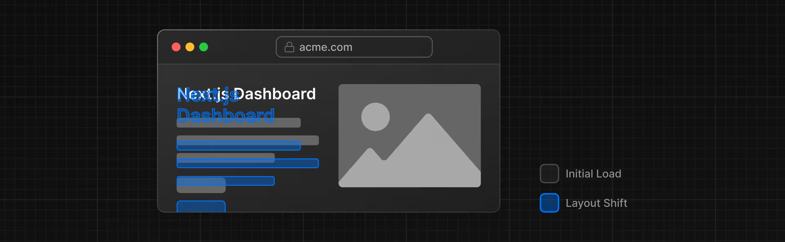

# 优化字体和图像

在上一章中，你学习了如何为你的 Next.js 应用程序设置样式。让我们继续处理你的主页，添加自定义字体和一个主图。

**在本章中……**

以下是我们将要涵盖的主题

- 如何使用 `next/font` 添加自定义字体。
- 如何使用 `next/image` 添加图片。
- 在 Next.js 中，字体和图片是如何优化的。

## 为什么要优化字体？

字体在网站设计中起着重要作用，但如果需要获取和加载字体文件，在项目中使用自定义字体可能会影响性能。

累积布局偏移（[Cumulative Layout Shift](https://vercel.com/blog/how-core-web-vitals-affect-seo)）是谷歌用于评估网站性能和用户体验的一个指标。在字体方面，当浏览器最初使用备用字体或系统字体渲染文本，然后在自定义字体加载完成后将其替换时，就会发生布局偏移。这种替换可能会导致文本大小、间距或布局发生变化，进而使周围的元素也随之移位。



当你使用 `next/font` 模块时，Next.js 会自动优化应用程序中的字体。它会在构建时下载字体文件，并将其与你的其他静态资源一起托管。这意味着当用户访问你的应用程序时，不会有额外的字体网络请求，而这种请求会影响性能。

## 添加主要字体

让我们为你的应用添加一种自定义的谷歌字体，看看这是如何运作的。

在你的 `/app/ui` 文件夹中，创建一个名为 `fonts.ts` 的新文件。你将使用这个文件来存放将在整个应用程序中使用的字体。

从 `next/font/google` 模块导入 `Inter` 字体——这将是你的主要字体。然后，指定你想要加载的子集。在这种情况下，选择 `"latin"`：

```ts
// /app/ui/fonts.ts

import { Inter } from "next/font/google";

export const inter = Inter({ subsets: ["latin"] });
```

最后，将字体添加到 `/app/layout.tsx` 中的 `<body>` 元素：

```tsx
// /app/layout.tsx

import "@/app/ui/global.css";
import { inter } from "@/app/ui/fonts";

export default function RootLayout({ children }: { children: React.ReactNode }) {
  return (
    <html lang="en">
      <body className={`${inter.className} antialiased`}>{children}</body>
    </html>
  );
}
```

通过向 `<body>`元素添加 `Inter`，该字体将应用于整个应用程序。在这里，你还添加了 Tailwind 的 [antialiased](https://tailwindcss.com/docs/font-smoothing) 类，它可以使字体更加平滑。使用这个类并非必需，但它能带来不错的效果。

打开浏览器，打开开发者工具并选择 body 元素。你应该会看到 `Inter` 和 `Inter_Fallback` 已应用在样式下方。

## 练习：添加次要字体

你也可以为应用程序的特定元素添加字体。

现在轮到你了！在你的 `fonts.ts` 文件中，导入一个名为 `Lusitana` 的次要字体，并将其传递给 `/app/page.tsx`文件中的 `<p>` 元素。除了像之前那样指定一个子集外，你还应该指定不同的字重。例如，`400`（normal）和 `700`（bold）。

准备好后，请展开下面的代码片段查看解决方案。

> 提示：
>
> - 如果你不确定要为字体传递哪些字重选项，请查看代码编辑器中的 TypeScript 错误。
> - 访问 [Google Fonts](https://fonts.google.com/) 网站，搜索 `Lusitana` 以查看可用的选项。
> - 请查看关于 [adding multiple fonts](https://nextjs.org/docs/app/getting-started/fonts#using-multiple-fonts)以及 [full list of options](https://nextjs.org/docs/app/api-reference/components/font#font-function-arguments)的文档。

```ts
// /app/ui/fonts.ts
import { Inter, Lusitana } from "next/font/google";

export const inter = Inter({ subsets: ["latin"] });

export const lusitana = Lusitana({
  weight: ["400", "700"],
  subsets: ["latin"],
});
```

```tsx
// /app/page.tsx

import AcmeLogo from "@/app/ui/acme-logo";
import { ArrowRightIcon } from "@heroicons/react/24/outline";
import Link from "next/link";
import { lusitana } from "@/app/ui/fonts";

export default function Page() {
  return (
    // ...
    <p className={`${lusitana.className} text-xl text-gray-800 md:text-3xl md:leading-normal`}>
      <strong>Welcome to Acme.</strong> This is the example for the{" "}
      <a href="https://nextjs.org/learn/" className="text-blue-500">
        Next.js Learn Course
      </a>
      , brought to you by Vercel.
    </p>
    // ...
  );
}
```

最后，`<AcmeLogo />`组件也使用了 Lusitana 字体。它之前被注释掉是为了防止出错，现在你可以取消注释了：

```tsx
// /app/page.tsx

// ...

export default function Page() {
  return (
    <main className="flex min-h-screen flex-col p-6">
      <div className="flex h-20 shrink-0 items-end rounded-lg bg-blue-500 p-4 md:h-52">
        <AcmeLogo />
        {/* ... */}
      </div>
    </main>
  );
}
```

太好了，你已经在你的应用程序中添加了两种自定义字体！接下来，让我们给主页添加一个醒目图片吧。

## 为什么要优化图像？

Next.js 可以在顶级的 `/public` 文件夹下提供**静态资源**，比如图片。[`/public`](https://nextjs.org/docs/app/api-reference/file-conventions/public-folder) 文件夹内的文件可以在你的应用程序中被引用。

使用常规的 HTML，你会按以下方式添加图片：

```html

```

然而，这意味着你必须手动：

- 确保你的图片在不同屏幕尺寸上都能自适应显示。
- 为不同设备指定图像尺寸。
- 防止图像加载时出现布局偏移。
- 延迟加载用户视口外的图像。

图像优化是 Web 开发中的一个大课题，其本身甚至可以被视为一个专业领域。你无需手动实施这些优化，而是可以使用 `next/image` 组件来自动优化你的图像。

## `<Image>` 组件

`<Image>` 组件是 HTML `` 标签的扩展，它具备自动图像优化功能，例如：

- 在图像加载时自动防止布局偏移。
