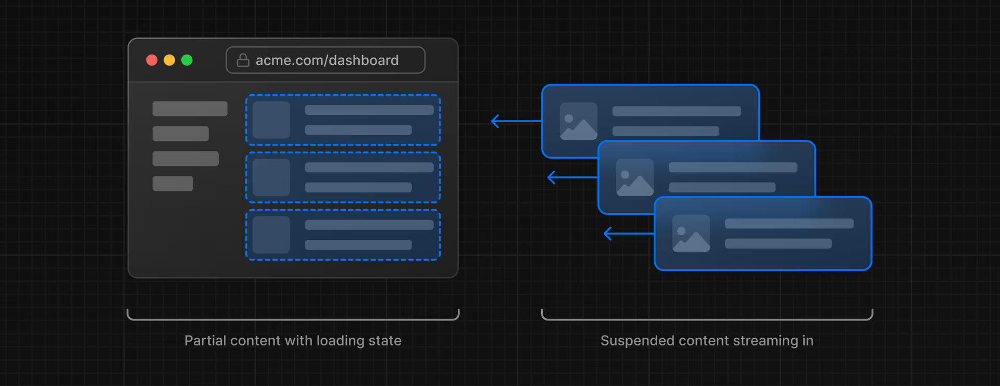
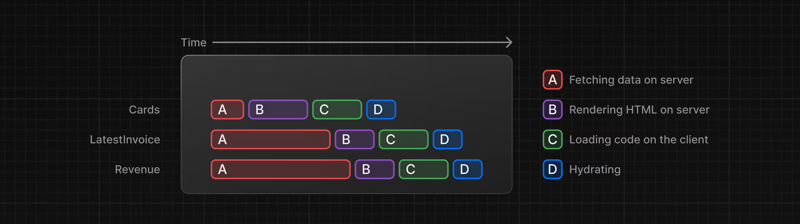
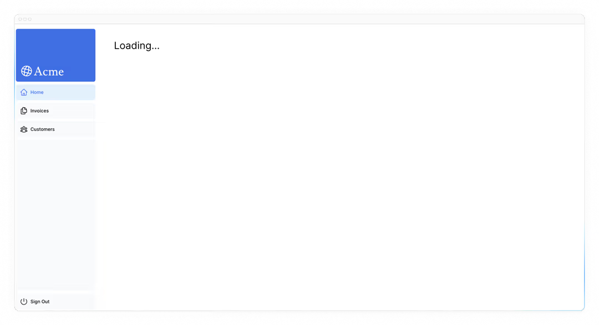
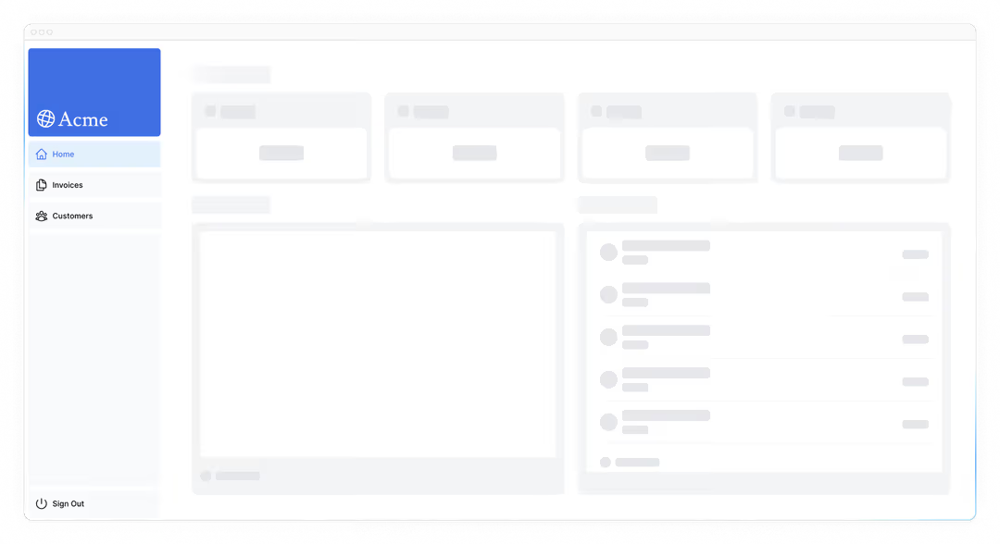
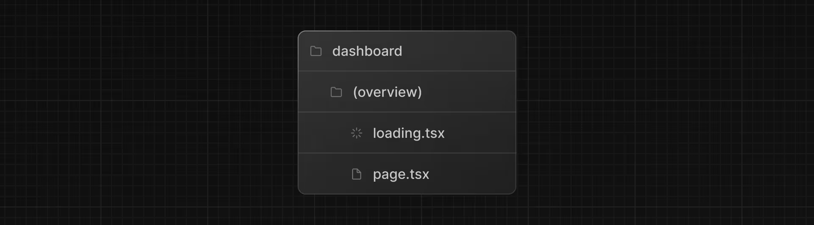
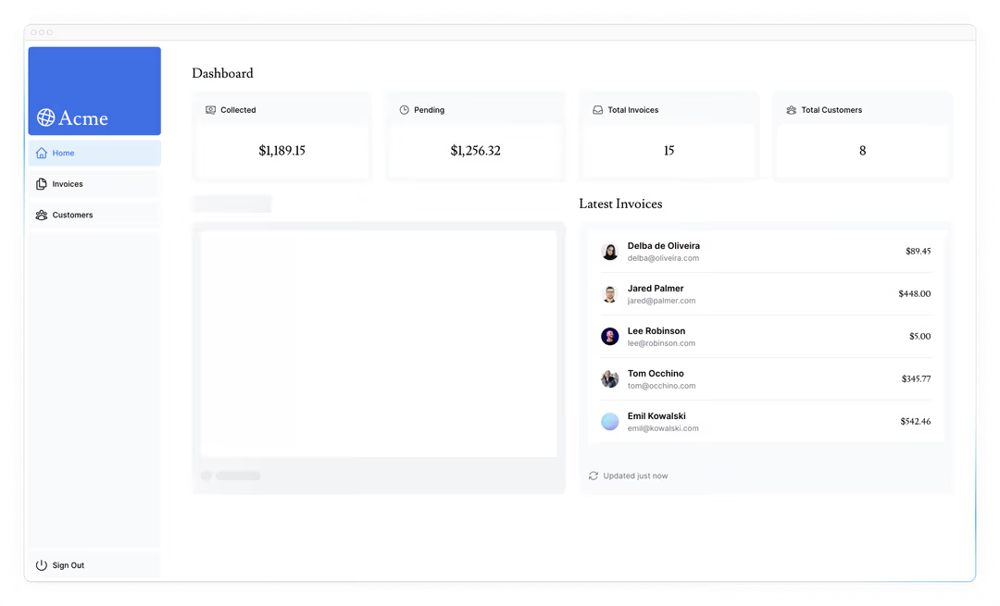

# 流媒体

在上一章中，你了解了 Next.js 的不同渲染方法。我们还讨论了慢数据获取如何影响应用性能。让我们看看当数据请求缓慢时，如何提升用户体验。

- 什么是流媒体，以及你可能什么时候使用。
- 如何实现使用 `loading.tsx` 和 Suspense 的流媒体。
- 什么是装载骨架。
- Next.js 路由组是什么，以及你什么时候可以使用它们。
- 在你的申请中，应该在哪里设置 React Suspense 的界限。

## 什么是流媒体？

流式传输是一种数据传输技术，允许你将路由拆分成更小的 "chunks"，并在服务器准备好时逐步从服务器流向客户端。



通过流式传输，你可以防止慢速数据请求阻断整个页面。这让用户无需等待所有数据加载完毕，就能查看和交互页面的部分内容，才能向用户展示任何界面。



流式传输与 React 的组件模型配合良好，因为每个组件都可以被视为一个块 。

在 Next.js 中实现流媒体有两种方式：

1. 在页面层面，使用 `loading.tsx` 文件（它为你创建了 `<Suspense>`）。
2. 在组件层面，则有 `<Suspense> ` 进行更细致的控制

让我们看看这是怎么运作的。

## 用 `loading.tsx` 流式传输整页

在 `/app/dashboard` 文件夹里，创建一个名为 `loading.tsx` 的新文件：

```tsx
// /app/dashboard/loading.tsx

export default function Loading() {
  return <div>Loading...</div>;
}
```

刷新 [http://localhost:3000/dashboard](http://localhost:3000/dashboard)，你现在应该会看到：



这里发生了几件事：

1. `loading.tsx` 是一个基于 React Suspense 构建的特殊 Next.js 文件。它允许你创建备用界面，在页面内容加载时作为替代显示。
2. 由于 `<SideNav>` 是静态的，所以会立即显示出来。用户可以在动态内容加载时与 `<SideNav>` 交互。
3. 用户无需等待页面加载完成后即可导航离开（这称为可中断导航）。

恭喜你！你刚刚实现了直播功能。但我们可以做得更多来提升用户体验。我们展示一个加载骨架，而不是 `Loading…` 文本。

## 添加加载骨架

加载骨架是界面的简化版本。许多网站将其用作占位符（或备份），以告知用户内容正在加载。你在 `loading.tsx` 添加的任何 UI 都会作为静态文件的一部分嵌入，并且会先发送。然后，其余的动态内容会从服务器流向客户端。

在你的 `loading.tsx` 文件中，导入一个名为 `<DashboardSkeleton>` 的新组件：

```tsx
// /app/dashboard/loading.tsx

import DashboardSkeleton from "@/app/ui/skeletons";

export default function Loading() {
  return <DashboardSkeleton />;
}
```

然后刷新 [http://localhost:3000/dashboard](http://localhost:3000/dashboard)，你现在应该会看到：



## 修复路由组加载骨架的漏洞

目前，你的装载骨架会应用到 invoices 上。

由于 `loading.tsx` 在文件系统中比 `/invoices/page.tsx` 和 `/customers/page.tsx` 高一级，所以这些页面也会被应用。

我们可以通过 [路由组](https://nextjs.org/docs/app/api-reference/file-conventions/route-groups) 来改变这一点。在仪表盘文件夹里创建一个名为 `/(overview)` 的新文件夹。然后，将你的 `loading.tsx` 和 `page.tsx` 文件移到文件夹内：



现在，`loading.tsx` 文件只会应用到你的 dashboard 概览页面。

路由组允许你将文件组织成逻辑组，而不影响 URL 路径结构。当你用括号 `()` 创建新文件夹时，名称不会包含在 URL 路径中。所以 `/dashboard/(overview)/page.tsx` 变成了 `/dashboard`。

这里，你使用路由组确保 `loading.tsx` 只适用于 dashboard 的总览页面。不过，你也可以用路由组将应用分成不同部分（例如 `(marketing)` 路由和 `(shop)` 路由），或者在较大的应用中按团队划分。

## 流式组件

到目前为止，你正在直播整整一页。但你也可以用 React Suspense 做更细化和流媒体专属的组件。

Suspense 允许你推迟渲染应用的部分，直到满足某个条件（例如数据加载）。你可以用悬念包裹你的动态组件。然后，传递一个备用组件，在动态组件加载时显示。

如果你还记得那个慢速数据请求 `fetchRevenue()`， 这就是导致整个页面变慢的请求。你可以用 Suspense 只屏蔽这个组件，并立即显示页面的其他界面。

为此，你需要把数据取用功能移到组件上，我们来更新代码看看具体效果：

删除所有 `fetchRevenue()` 及其数据实例： `/dashboard/(overview)/page.tsx`

```tsx
// /app/dashboard/(overview)/page.tsx

import { Card } from '@/app/ui/dashboard/cards';
import RevenueChart from '@/app/ui/dashboard/revenue-chart';
import LatestInvoices from '@/app/ui/dashboard/latest-invoices';
import { lusitana } from '@/app/ui/fonts';
import { fetchLatestInvoices, fetchCardData } from '@/app/lib/data'; // remove fetchRevenue

export default async function Page() {
  const revenue = await fetchRevenue() // delete this line
  const latestInvoices = await fetchLatestInvoices();
  const {
    numberOfInvoices,
    numberOfCustomers,
    totalPaidInvoices,
    totalPendingInvoices,
  } = await fetchCardData();

  return (
    // ...
  );
}
```

然后，从 React 导入 `<Suspense>`，包裹在 `<RevenueChart />` 上。你可以通过一个叫做 `<RevenueChartSkeleton>` 的备用组件传递给它。

```tsx
// /app/dashboard/(overview)/page.tsx

import { Card } from "@/app/ui/dashboard/cards";
import RevenueChart from "@/app/ui/dashboard/revenue-chart";
import LatestInvoices from "@/app/ui/dashboard/latest-invoices";
import { lusitana } from "@/app/ui/fonts";
import { fetchLatestInvoices, fetchCardData } from "@/app/lib/data";
import { Suspense } from "react";
import { RevenueChartSkeleton } from "@/app/ui/skeletons";

export default async function Page() {
  const latestInvoices = await fetchLatestInvoices();
  const { numberOfInvoices, numberOfCustomers, totalPaidInvoices, totalPendingInvoices } = await fetchCardData();

  return (
    <main>
      <h1 className={`${lusitana.className} mb-4 text-xl md:text-2xl`}>Dashboard</h1>
      <div className="grid gap-6 sm:grid-cols-2 lg:grid-cols-4">
        <Card title="Collected" value={totalPaidInvoices} type="collected" />
        <Card title="Pending" value={totalPendingInvoices} type="pending" />
        <Card title="Total Invoices" value={numberOfInvoices} type="invoices" />
        <Card title="Total Customers" value={numberOfCustomers} type="customers" />
      </div>
      <div className="mt-6 grid grid-cols-1 gap-6 md:grid-cols-4 lg:grid-cols-8">
        <Suspense fallback={<RevenueChartSkeleton />}>
          <RevenueChart />
        </Suspense>
        <LatestInvoices latestInvoices={latestInvoices} />
      </div>
    </main>
  );
}
```

最后，更新 `<RevenueChart>` 组件，使其获取自身数据并移除传递给它的 prop：

```tsx
// /app/ui/dashboard/revenue-chart.tsx

import { generateYAxis } from '@/app/lib/utils';
import { CalendarIcon } from '@heroicons/react/24/outline';
import { lusitana } from '@/app/ui/fonts';
import { fetchRevenue } from '@/app/lib/data';

// ...

export default async function RevenueChart() { // Make component async, remove the props
  const revenue = await fetchRevenue(); // Fetch data inside the component

  const chartHeight = 350;
  const { yAxisLabels, topLabel } = generateYAxis(revenue);

  if (!revenue || revenue.length === 0) {
    return <p className="mt-4 text-gray-400">No data available.</p>;
  }

  return (
    // ...
  );
}

```

现在刷新页面，你应该几乎立刻看到仪表盘信息，同时显示了 `<RevenueChart>` 的备用骨架：



## 实践：流媒体 `<LatestInvoices>`

现在轮到你了！通过流媒体播放 `<LatestInvoices>` 组件来练习你刚学到的内容。

将 `fetchLatestInvoices()` 从页面移到 `<LatestInvoices>` 组件。将组件包裹在 `<Suspense>` 边界中，并有一个名为 `<LatestInvoicesSkeleton>` 的备用窗口。

准备好后，展开开关查看解决方案代码：

Dashboard Page:

```tsx
// /app/dashboard/(overview)/page.tsx

import { Card } from "@/app/ui/dashboard/cards";
import RevenueChart from "@/app/ui/dashboard/revenue-chart";
import LatestInvoices from "@/app/ui/dashboard/latest-invoices";
import { lusitana } from "@/app/ui/fonts";
import { fetchCardData } from "@/app/lib/data"; // Remove fetchLatestInvoices
import { Suspense } from "react";
import { RevenueChartSkeleton, LatestInvoicesSkeleton } from "@/app/ui/skeletons";

export default async function Page() {
  // Remove `const latestInvoices = await fetchLatestInvoices()`
  const { numberOfInvoices, numberOfCustomers, totalPaidInvoices, totalPendingInvoices } = await fetchCardData();

  return (
    <main>
      <h1 className={`${lusitana.className} mb-4 text-xl md:text-2xl`}>Dashboard</h1>
      <div className="grid gap-6 sm:grid-cols-2 lg:grid-cols-4">
        <Card title="Collected" value={totalPaidInvoices} type="collected" />
        <Card title="Pending" value={totalPendingInvoices} type="pending" />
        <Card title="Total Invoices" value={numberOfInvoices} type="invoices" />
        <Card title="Total Customers" value={numberOfCustomers} type="customers" />
      </div>
      <div className="mt-6 grid grid-cols-1 gap-6 md:grid-cols-4 lg:grid-cols-8">
        <Suspense fallback={<RevenueChartSkeleton />}>
          <RevenueChart />
        </Suspense>
        <Suspense fallback={<LatestInvoicesSkeleton />}>
          <LatestInvoices />
        </Suspense>
      </div>
    </main>
  );
}
```

`<LatestInvoices>` 组件。记得把道具从组件上拆下来：

```tsx
// /app/ui/dashboard/latest-invoices.tsx

import { ArrowPathIcon } from '@heroicons/react/24/outline';
import clsx from 'clsx';
import Image from 'next/image';
import { lusitana } from '@/app/ui/fonts';
import { fetchLatestInvoices } from '@/app/lib/data';

export default async function LatestInvoices() { // Remove props
  const latestInvoices = await fetchLatestInvoices();

  return (
    // ...
  );
}
```

## 分组组件

太好了！你快完成了，现在你需要把 `<Card>` 的组件包裹进 Suspense 里。你可以为每 card 获取数据，但这可能导致 card 加载时出现爆裂声，对用户来说视觉上会很突兀。

那么，你会如何解决这个问题？

为了营造更错落的效果，可以用包装组件将卡片分组。这意味着静态的 `<SideNav/>` 会先显示，然后是卡片等。

在你的 `page.tsx` 文件里：

1. 删除你的 `<Card>` 组件。
2. 删除 `fetchCardData()` 函数。
3. 导入一个新的包装组件，名为 `<CardWrapper />`。
4. 导入一个名为 `<CardsSkeleton />` 的新骨架组件
5. 用 Suspense 包裹 `<CardWrapper />`。

```tsx
// /app/dashboard/(overview)/page.tsx

import CardWrapper from "@/app/ui/dashboard/cards";
// ...
import { RevenueChartSkeleton, LatestInvoicesSkeleton, CardsSkeleton } from "@/app/ui/skeletons";

export default async function Page() {
  return (
    <main>
      <h1 className={`${lusitana.className} mb-4 text-xl md:text-2xl`}>Dashboard</h1>
      <div className="grid gap-6 sm:grid-cols-2 lg:grid-cols-4">
        <Suspense fallback={<CardsSkeleton />}>
          <CardWrapper />
        </Suspense>
      </div>
      // ...
    </main>
  );
}
```

然后进入 `/app/ui/dashboard/cards.tsx` 文件，导入 `fetchCardData()` 函数，并在 `<CardWrapper/>` 组件中调用它。确保取消该组件中所有必要代码的注释。

```tsx
// /app/ui/dashboard/cards.tsx

// ...
import { fetchCardData } from "@/app/lib/data";

// ...

export default async function CardWrapper() {
  const { numberOfInvoices, numberOfCustomers, totalPaidInvoices, totalPendingInvoices } = await fetchCardData();

  return (
    <>
      <Card title="Collected" value={totalPaidInvoices} type="collected" />
      <Card title="Pending" value={totalPendingInvoices} type="pending" />
      <Card title="Total Invoices" value={numberOfInvoices} type="invoices" />
      <Card title="Total Customers" value={numberOfCustomers} type="customers" />
    </>
  );
}
```

刷新页面，你应该会看到所有卡片同时加载。当你想同时加载多个组件时，可以用这个模式。

## 决定如何设定你的 suspense 界限

你设定 suspense 界限的方向取决于几个方面：

1. 你希望用户在页面流媒体时如何体验页面。
2. 你想优先考虑哪些内容。
3. 如果组件依赖数据获取。

看看你的 dashboard 页面，有什么你会做得不一样的地方吗？

别担心。没有绝对的正确答案。

- 你可以像我们用 `loading.tsx` 那样直播整个页面 ......但如果某个组件的数据取用较慢，可能会导致加载时间更长。
- 你可以逐个流媒体播放每个组件 ......但这可能会导致界面在准备好时弹出 。
- 你也可以通过流式页面部分来创造错开效果。但你需要创建包装组件。

你设定 suspense 边界的位置会根据你的应用而有所不同。一般来说，把数据取用顺序移到需要数据的组件，然后用 Suspense 包裹这些组件是个好习惯。但如果你的应用需要，流式播放部分或整页也没问题。

不要害怕尝试 Suspense，看看哪种效果最好，它是一个强大的 API，能帮助你创造更愉快的用户体验。

## 展望未来

流式和服务器组件为我们提供了处理数据获取和加载状态的新方法，最终目标是提升终端用户体验。

在下一章中，你将学习如何使用 Next.js API 为 dashboard 应用添加搜索和分页功能。

[下一章](./第十章.md)