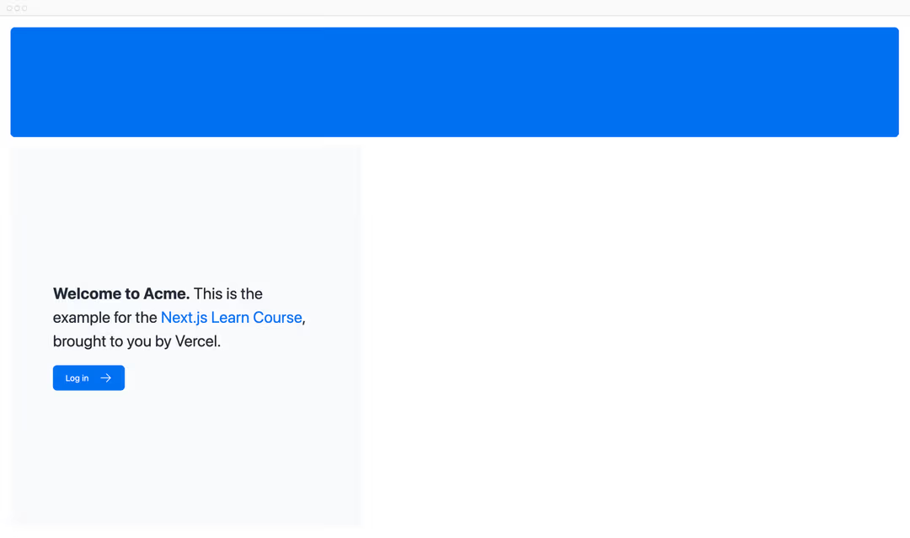

# CSS 样式

目前，你的主页没有任何样式。让我们来看看为你的Next.js应用程序设置样式的不同方法。

**在本章中……**

以下是我们将要涵盖的主题

- 如何向你的应用程序添加全局CSS文件。
- 两种不同的样式设计方式：Tailwind 和 CSS 模块。
- 如何使用 clsx 工具包有条件地添加类名。

## 全局样式

如果你查看 `/app/ui` 文件夹内部，会看到一个名为 `global.css` 的文件。你可以使用这个文件为应用程序中的所有路由添加 CSS 规则，例如 CSS 重置规则、针对链接等 HTML 元素的全站样式等等。

你可以在应用程序的任何组件中导入 `global.css` ，但通常最好的做法是将其添加到顶级组件中。在 Next.js 中，这就是 [root layout](https://nextjs.org/docs/app/api-reference/file-conventions/layout#root-layouts)（稍后会详细介绍）。

通过导航至 `/app/layout.tsx` 并导入 `global.css` 文件，为你的应用添加全局样式：

```tsx
// /app/layout.tsx

import "@/app/ui/global.css"; // +

export default function RootLayout({ children }: { children: React.ReactNode }) {
  return (
    <html lang="en">
      <body>{children}</body>
    </html>
  );
}
```

在开发服务器仍在运行的情况下，保存你的更改并在浏览器中预览它们。你的主页现在应该看起来像这样：


但是等一下，你没有添加任何 CSS 规则，这些样式是从哪里来的呢？

如果你查看 `global.css` 内部，会发现一些 `@tailwind` 指令：

```css
/* /app/ui/global.css */

@tailwind base;
@tailwind components;
@tailwind utilities;
```

## Tailwind

[Tailwind](https://tailwindcss.com/) 是一个CSS框架，它允许你直接在 React 代码中快速编写 [工具类](https://tailwindcss.com/docs/styling-with-utility-classes)，从而加快开发过程。

在 Tailwind 中，你通过添加类名来设置元素的样式。例如，添加 `"text-blue-500"` 会使 `<h1>` 文本变成蓝色：

```tsx
<h1 className="text-blue-500">I'm blue!</h1>
```

尽管 CSS 样式是全局共享的，但每个类都单独应用于每个元素。这意味着，如果你添加或删除某个元素，无需担心维护单独的样式表、样式冲突，或者随着应用程序的扩展，CSS捆绑包的大小会不断增加。

当你使用 `create-next-app` 启动一个新项目时，Next.js 会询问你是否要使用 Tailwind 。如果你选择 `"yes"`，Next.js会自动安装必要的包并在你的应用程序中配置 Tailwind。

如果你查看 `/app/page.tsx` ，会发现我们在示例中使用了 Tailwind 类。

```tsx
// /app/page.tsx

import AcmeLogo from '@/app/ui/acme-logo';
import { ArrowRightIcon } from '@heroicons/react/24/outline';
import Link from 'next/link';

export default function Page() {
  return (
    // These are Tailwind classes:
    <main className="flex min-h-screen flex-col p-6">
      <div className="flex h-20 shrink-0 items-end rounded-lg bg-blue-500 p-4 md:h-52">
    // ...

  )
}
```

如果这是你第一次使用 Tailwind ，不用担心。为了节省时间，我们已经为你将要使用的所有组件设置好了样式。

让我们用 Tailwind 来试试吧！复制下面的代码，并粘贴到 `/app/page.tsx` 中 `<p>` 元素的上方：

```tsx
// /app/page.tsx

<div className="relative w-0 h-0 border-l-[15px] border-r-[15px] border-b-[26px] border-l-transparent border-r-transparent border-b-black" />
```

如果你更喜欢编写传统的 CSS 规则，或者希望将样式与 JSX 分开，那么 CSS Modules 会是一个很好的替代方案。

## CSS Modules

[CSS Modules](https://nextjs.org/docs/app/getting-started/css#css-modules) 允许你通过自动创建独特的类名来将 CSS 限定在某个组件的范围内，这样你也不必担心样式冲突了。

在本课程中，我们将继续使用 Tailwind，但让我们花点时间看看如何使用 CSS Modules 实现上述测验中的相同结果。

在 `/app/ui` 目录下，创建一个名为 `home.module.css` 的新文件，并添加以下 CSS Modules：

```css
/* /app/ui/home.module.css */

.shape {
  height: 0;
  width: 0;
  border-bottom: 30px solid black;
  border-left: 20px solid transparent;
  border-right: 20px solid transparent;
}
```

然后，在你的 `/app/page.tsx` 文件中导入样式，并将你添加的 `<div>` 中的 Tailwind 类名替换为 `styles.shape`：

```tsx
// /app/page.tsx

import AcmeLogo from '@/app/ui/acme-logo';
import { ArrowRightIcon } from '@heroicons/react/24/outline';
import Link from 'next/link';
import styles from '@/app/ui/home.module.css'; // +

export default function Page() {
  return (
    <main className="flex min-h-screen flex-col p-6">
      <div className={styles.shape} /> // +
    // ...
  )
}
```

保存你的更改，并在浏览器中预览它们。你应该会看到与之前相同的形状。

Tailwind 和 CSS Modules 是为 Next.js 应用程序设置样式的两种最常见方式。使用哪一种取决于个人偏好——你甚至可以在同一个应用程序中同时使用两者！

## 使用 `clsx` 库来切换类名

在某些情况下，你可能需要根据状态或其他一些条件来有条件地设置元素的样式。

[clsx](https://www.npmjs.com/package/clsx) 是一个能让你轻松切换类名的库。我们建议查看[文档](https://github.com/lukeed/clsx) 以了解更多细节，不过下面是基本用法：

- 假设你想要创建一个接收状态的 `InvoiceStatus` 组件。该状态可以是 `"pending"`或 `"paid"`。
- 如果状态是 `"paid"`，你希望颜色为绿色。如果状态是 `"pending"` ，你希望颜色为灰色。

```tsx
// /app/ui/invoices/status.tsx

import clsx from 'clsx';

export default function InvoiceStatus({ status }: { status: string }) {
  return (
    <span
      className={clsx(
        'inline-flex items-center rounded-full px-2 py-1 text-sm',
        {
          'bg-gray-100 text-gray-500': status === 'pending',
          'bg-green-500 text-white': status === 'paid',
        },
      )}
    >
    // ...
)}
```

## 其他样式解决方案

除了我们已经讨论过的方法之外，你还可以通过以下方式为你的Next.js应用程序设置样式：

- Sass 允许你导入 `.css` 和 `.scss` 文件。
- CSS-in-JS 库，例如 [styled-jsx](https://github.com/vercel/styled-jsx)、[styled-components](https://github.com/vercel/next.js/tree/canary/examples/with-styled-components) 和 [emotion](https://github.com/vercel/next.js/tree/canary/examples/with-emotion)。

查看 [CSS文档](https://nextjs.org/docs/app/getting-started/css) 以获取更多信息。

[进入第三章](./第三章.md)
