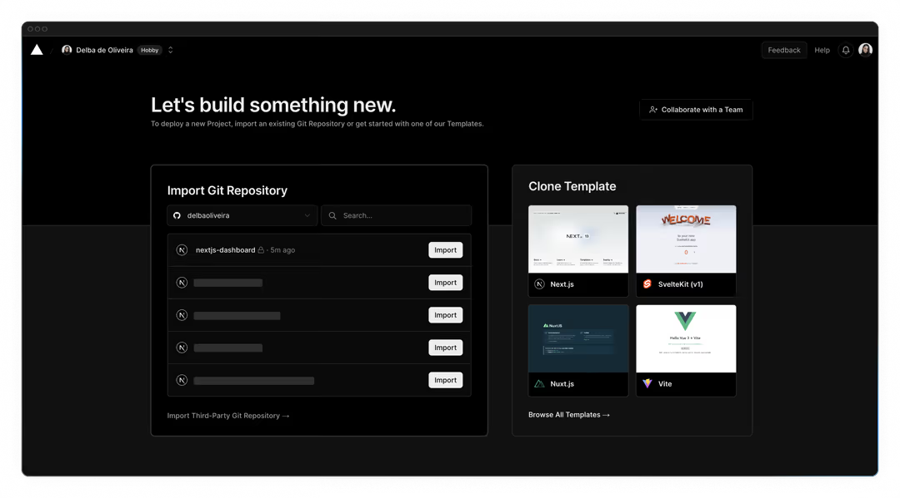
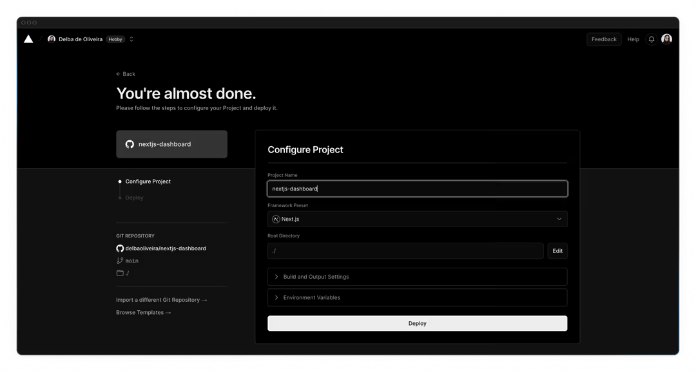
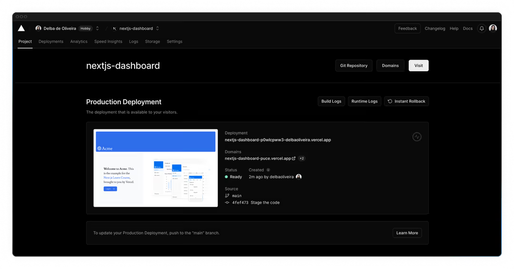
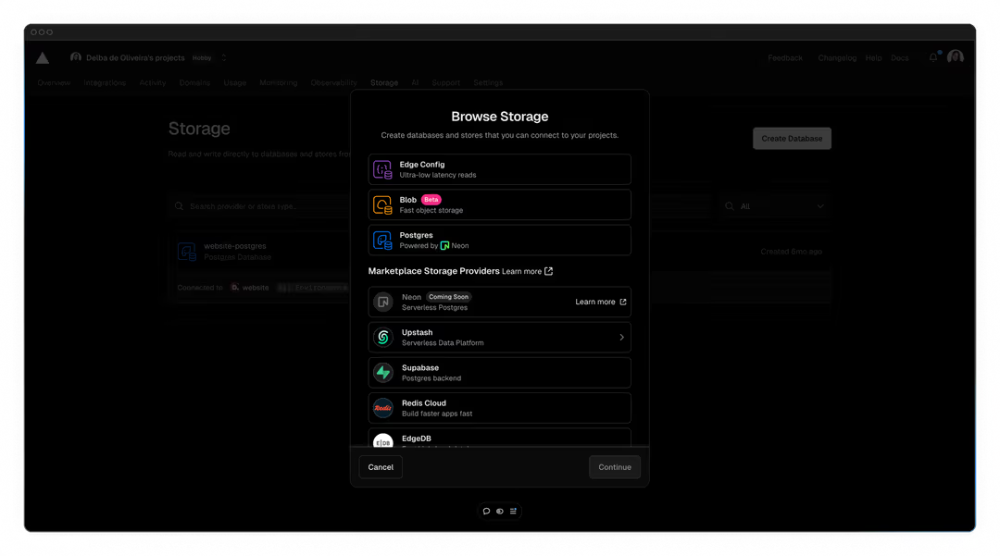
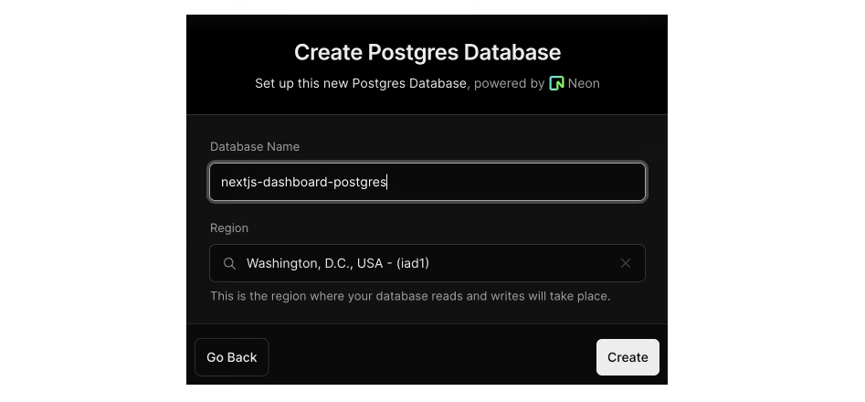
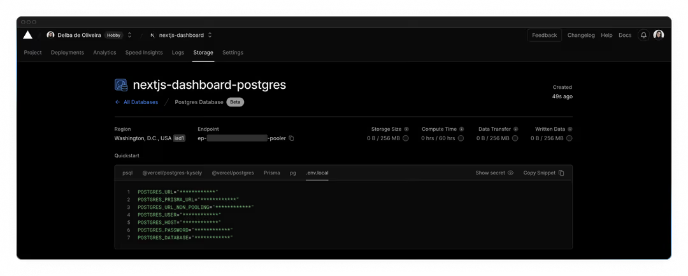

# 设置你的数据库

在继续处理你的 dashboard 之前，你需要一些数据。在本章中，你将通过 [Vercel的市场集成](https://vercel.com/marketplace/category/storage?category=storage) 之一来设置一个 PostgreSQL 数据库。如果你已经熟悉 PostgreSQL，并且更愿意使用自己的数据库提供商，那么你可以跳过本章，自行进行设置。否则，让我们继续吧！

- 将你的项目推送到GitHub。
- 创建一个 Vercel 账户，并关联你的 GitHub 仓库，以获得即时预览和部署功能。
- 创建项目并将其与 Postgres 数据库关联。
- 用初始数据填充数据库。

## 创建一个 GitHub 仓库

首先，如果你还没有将代码仓库推送到 GitHub，那就先这么做吧。这会让你更轻松地设置数据库和进行部署。

如果你需要帮助设置仓库，可以查看 [GitHub上的这份指南](https://docs.github.com/en/repositories/creating-and-managing-repositories/quickstart-for-repositories) 。

> 需要知道：
>
> - 你也可以使用其他 Git 提供商，如 GitLab 或 Bitbucket。
> - 如果你是 GitHub 新手，我们推荐使用 [GitHub Desktop 应用程序](https://github.com/apps/desktop)，它能提供简化的开发工作流程。

## 创建一个 Vercel 账户

访问 [vercel.com/signup](https://vercel.com/signup) 创建一个账户。选择免费的 "hobby" 计划。选择 **Continue with GitHub** 来关联你的 GitHub 和 Vercel账户。

## 连接并部署您的项目

接下来，你会进入这个界面，在那里你可以选择并导入你刚刚创建的 GitHub 仓库：



为你的项目命名，然后点击 **Deploy**。



太棒了！🎉 你的项目现已部署完成。



通过连接你的 GitHub 仓库，每当你向主分支推送更改时，Vercel 会自动重新部署你的应用程序，无需任何配置。打开拉取请求时，你还会获得[即时预览URL](https://vercel.com/docs/deployments/environments#preview-environment-pre-production#preview-urls)，这能让你尽早发现部署错误，并与团队成员分享项目预览以获取反馈。

## 创建一个 Postgres 数据库

接下来，要设置数据库，请点击 **Continue to Dashboard** ，然后从项目仪表板中选择 **Storage** 选项卡。选择 **Create Database**。根据你的 Vercel 账户的创建时间，你可能会看到像 Neon 或 Supabase 这样的选项。选择你偏好的提供商，然后点击 **Continue** 。



选择您的地区和存储计划（如有需要）。所有 Vercel 项目的[默认地区](https://vercel.com/docs/functions/configuring-functions/region)是 **Washington D.C (iad1)**，如果该地区可用，我们建议您选择它，以减少数据请求的[延迟](https://developer.mozilla.org/en-US/docs/Web/Performance/Understanding_latency)。



连接后，导航至 `.env.local` 标签页，点击 **Show secret** 并 **Copy Snippet** 。确保在复制前先显示密钥。



打开你的代码编辑器，将 `.env.example` 文件重命名为 `.env` 。将从 Vercel 复制的内容粘贴进去。

> 重要提示：打开你的 `.gitignore`文件，确保 `.env` 在被忽略的文件列表中，以防止你向 GitHub 推送代码时泄露数据库密钥。

## 填充你的数据库

既然你的数据库已经创建好了，那我们就用一些初始数据来填充它吧。

我们提供了一个可在浏览器中访问的API，它将运行一个种子脚本，用初始数据集填充数据库。

该脚本使用 SQL 创建表，并在表创建完成后，利用 `placeholder-data.ts` 文件中的数据填充这些表。

确保你的本地开发服务器通过 `pnpm run dev`运行，并在浏览器中导航至 [localhost:3000/seed](localhost:3000/seed)。完成后，你将在浏览器中看到 "Database seeded successfully" 的消息。完成后，你可以删除此文件。

> 故障排除：
>
> - 在将数据库密钥复制到 `.env` 文件之前，务必先展示它们。
> - 该脚本使用 bcrypt 对用户密码进行哈希处理，如果 bcrypt 与你的环境不兼容，你可以更新脚本以改用 [bcryptjs](https://www.npmjs.com/package/bcryptjs)。
> - 如果在为数据库填充数据时遇到任何问题，并且想要重新运行脚本，你可以在数据库查询界面中执行 `DROP TABLE tablename` 来删除任何现有的表。有关更多详细信息，请参见下面的 [执行查询部分](#执行查询) 。
>   。但要注意，这个命令会删除表及其所有数据。对于你的示例应用程序来说，这样做是没问题的，因为你使用的是占位数据，但在生产应用程序中不应该运行这个命令。

## 执行查询

让我们执行一个查询，以确保一切都按预期运行。我们将使用另一个路由处理器 `app/query/route.ts` 来查询数据库。在这个文件中，你会找到一个`listInvoices()`函数，它包含以下 SQL查询。

```sql
SELECT invoices.amount, customers.name
FROM invoices
JOIN customers ON invoices.customer_id = customers.id
WHERE invoices.amount = 666;
```

取消文件的注释，移除 `Response.json() block`，然后在浏览器中导航至 [localhost:3000/query](localhost:3000/query) 。你应该会看到返回了一张发票的 amount 和 name。

[下一章](./第七章.md)