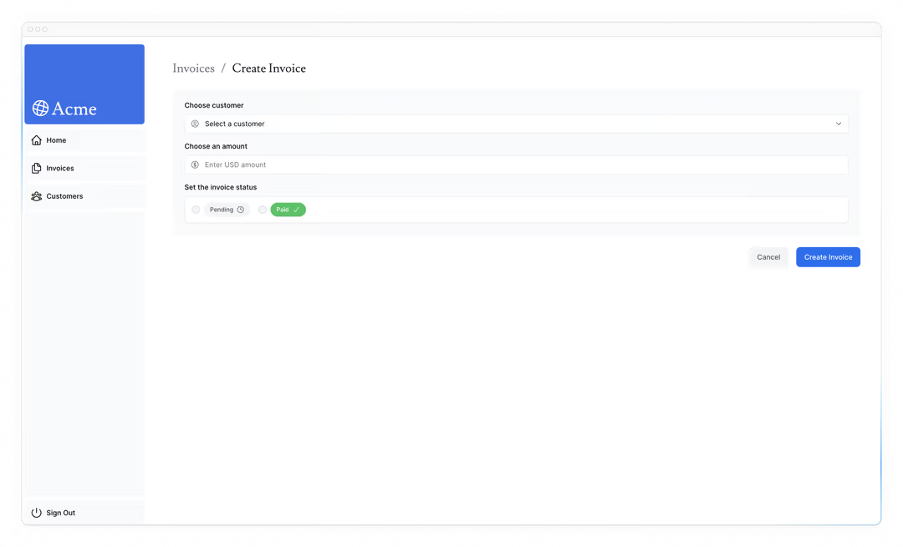
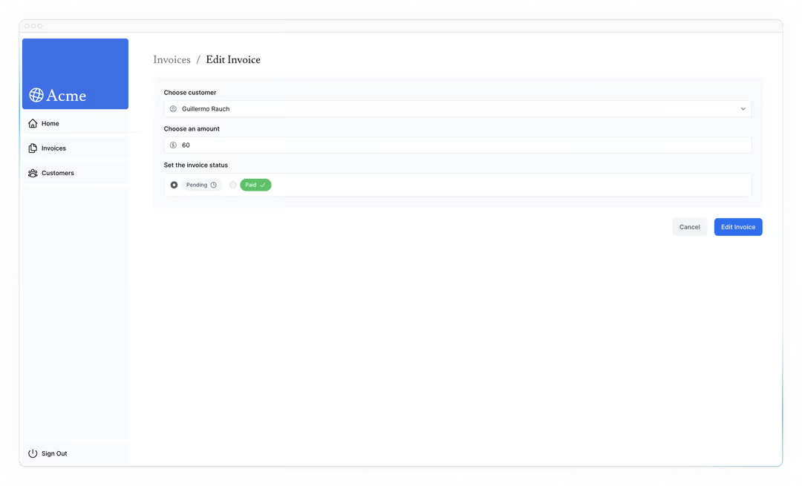

# 变化数据

在上一章中，你实现了使用 URL 搜索参数和 Next.js API 的搜索和分页功能。让我们继续在 invoices 页面上工作，添加创建、更新和删除 invoices 的功能！

- 什么是 React 服务器动作，以及如何利用它们来变化数据。
- 如何操作表单和服务器组件。
- 使用原生 `FormData` 对象的最佳实践，包括类型验证。
- 如何使用 `revalidatePath` API 重新验证客户端缓存。
- 如何创建带有特定 ID 的动态路由段。

## 什么是服务器操作？

React 服务器动作允许你直接在服务器上运行异步代码。它们消除了创建 API 端点来改变数据的需求。相反，你编写的异步函数可以在服务器上执行，并可从客户端或服务器组件调用。

安全性是网页应用的首要任务，因为它们可能受到各种威胁的威胁。这正是服务器操作发挥作用的地方。它们包括加密闭合、严格输入检查、错误消息哈希、主机限制等功能——所有这些功能协同作用，显著提升你的应用安全性。

## 使用带有服务器操作的表单

在 React 中，你可以在 `<form>` 元素中使用 `action` 属性来调用动作。动作会自动接收包含捕获数据的本地 [FormData](https://developer.mozilla.org/en-US/docs/Web/API/FormData) 对象。

例如：

```tsx
// Server Component
export default function Page() {
  // Action
  async function create(formData: FormData) {
    "use server";

    // Logic to mutate data...
  }

  // Invoke the action using the "action" attribute
  return <form action={create}>...</form>;
}
```

在服务器组件中调用服务器动作的一个优点是渐进式增强——即使客户端尚未加载 JavaScript，表单也能正常工作。例如，没有较慢的互联网连接。

## Next.js 服务器操作

服务器动作也深度集成于 Next.js [缓存](https://nextjs.org/docs/app/building-your-application/caching)中。当表单通过服务器动作提交时，你不仅可以用该动作变更数据，还可以通过 `revalidatePath` 和 `revalidateTag` 等 API 重新验证相关缓存。

让我们看看它们如何协同工作！

## 创建 invoice

以下是创建新 invoice 的步骤：

1. 创建一个表单来记录用户的输入。
2. 创建一个服务器动作，并从表单中调用它。
3. 在服务器操作中，从 `formData` 对象中提取数据。
4. 验证并准备数据，以便插入到你的数据库中。
5. 插入数据并处理任何错误。
6. 重新验证缓存，并将用户重定向到 invoices 页面。

### 1. 创建新的路线和形式

首先，在 `/invoices` 文件夹内，添加一个名为 `/create` 的新路由段，并使用 `page.tsx` 文件：


你将使用这条路径来创建新的 invoices 。在你的 `page.tsx` 文件中，粘贴以下代码，然后花时间研究：

```tsx
// /dashboard/invoices/create/page.tsx

import Form from "@/app/ui/invoices/create-form";
import Breadcrumbs from "@/app/ui/invoices/breadcrumbs";
import { fetchCustomers } from "@/app/lib/data";

export default async function Page() {
  const customers = await fetchCustomers();

  return (
    <main>
      <Breadcrumbs
        breadcrumbs={[
          { label: "Invoices", href: "/dashboard/invoices" },
          {
            label: "Create Invoice",
            href: "/dashboard/invoices/create",
            active: true,
          },
        ]}
      />
      <Form customers={customers} />
    </main>
  );
}
```

你的页面是一个服务器组件，负责获取客户并将其传递给 `<Form>` 组件。为了节省时间，我们已经为您创建了 `<Form>` 组件。

导航到 `<Form>` 组件，你会看到以下表单：

- 有一个 `<select>`（下拉菜单）元素，里面有 customers 列表。
- 有一个 `<input>` 元素，代表 `type="number"` 的 amount 。
- 状态有两个 `<input>` 元素，` type="radio"`。
- 有一个按钮， `type="submit"`。

在 [http://localhost:3000/dashboard/invoices/create](在 http://localhost:3000/dashboard/invoices/create 上，你应该会看到以下界面：) 上，你应该会看到以下界面：



### 2. 创建服务器操作

很好，现在我们创建一个服务器动作，在提交表单时调用。

进入你的 `lib/` 目录，创建一个名为 `actions.ts` 的新文件。在这个文件顶部，添加 React [`use server`](https://react.dev/reference/react/use-server) 指令：

```ts
// /app/lib/actions.ts

"use server";
```

通过添加 `"use server"`，文件中导出的所有函数都标记为服务器操作。这些服务器功能随后可以导入并用于客户端和服务器组件中。本文件中未被使用的功能将自动从最终应用包中移除。

你也可以直接在服务器组件里写服务器动作，在动作里加上 "use server"`。但在本课程中，我们会把它们都整理在一个单独的文件里。我们建议为你的 actons 单独准备一个档案。

在你的 `actions.ts` 文件中，创建一个新的异步函数，接受 `formData`：

```ts
// /app/lib/actions.ts

"use server";

export async function createInvoice(formData: FormData) {}
```

然后，在你的 `<Form>` 组件中，导入 `actions.ts` 文件中的 `createInvoice`。在 `<form>` 元素中添加一个动作属性，并调用 `createInvoice` 动作。

```tsx
// /app/ui/invoices/create-form.tsx

import { CustomerField } from '@/app/lib/definitions';
import Link from 'next/link';
import {
  CheckIcon,
  ClockIcon,
  CurrencyDollarIcon,
  UserCircleIcon,
} from '@heroicons/react/24/outline';
import { Button } from '@/app/ui/button';
import { createInvoice } from '@/app/lib/actions';

export default function Form({
  customers,
}: {
  customers: CustomerField[];
}) {
  return (
    <form action={createInvoice}>
      // ...
  )
}
```

> 需要知道：在 HTML 中，你会把一个 URL 传递给 `action` 属性。这个 URL 是表格数据提交的目的地（通常是 API 端点）。
>
> 然而，在 React 中，`action` 属性被视为特殊 prop ——意味着 React 会在其基础上构建，允许调用 actions。
>
> 在幕后，服务器动作创建了一个 `POST` API 端点。这就是为什么使用服务器操作时不需要手动创建 API 端点。

### 3. 从 formData 中提取数据

回到你的 `actions.ts` 文件，你需要提取 `formData` 的值，有[几种方法](https://developer.mozilla.org/en-US/docs/Web/API/FormData)可以用。在这个例子中，我们使用 [`.get(name)`](https://developer.mozilla.org/en-US/docs/Web/API/FormData/get) 方法。

```ts
// /app/lib/actions.ts

"use server";

export async function createInvoice(formData: FormData) {
  const rawFormData = {
    customerId: formData.get("customerId"),
    amount: formData.get("amount"),
    status: formData.get("status"),
  };
  // Test it out:
  console.log(rawFormData);
}
```

> 提示： 如果你处理的是包含多个字段的表单，可以考虑使用 [`entries()`](https://developer.mozilla.org/en-US/docs/Web/API/FormData/entries) 方法配合 JavaScript 的 [`Object.fromEntries()`](https://developer.mozilla.org/en-US/docs/Web/JavaScript/Reference/Global_Objects/Object/fromEntries) 方法。

要检查所有部件是否正确连接，可以试试这个 form。提交后，你应该会看到你刚输入表单的数据被记录在终端 （不是浏览器里）。

现在你的数据已经呈现出一个物体的形状，处理起来会容易得多。

### 4. 验证并准备数据

在将表单数据发送到数据库之前，你需要确保格式和类型正确。如果你还记得课程前面提到的，你的 invoices 表期望数据格式如下：

```ts
// /app/lib/definitions.ts

export type Invoice = {
  id: string; // Will be created on the database
  customer_id: string;
  amount: number; // Stored in cents
  status: "pending" | "paid";
  date: string;
};
```

目前你只有表格上的 `customer_id`、 `amount` 和 `状态` 。

#### 类型验证与强制

验证表单中的数据是否与数据库中预期的类型一致非常重要。例如，如果你在 action 中添加了一个 `console.log`：

```ts
console.log(typeof rawFormData.amount);
```

你会注意到这个 `amount` 是 `string` 类型 ，而不是 `number` 。这是因为`type="number"` 的输入元素实际上返回的是字符串，而不是数字！

处理类型验证时，你有几个选择。虽然你可以手动验证类型，但使用类型验证库可以节省时间和精力。以你的例子为例，我们将使用 [Zod](https://zod.dev/)，一个以 TypeScript 为先的验证库，可以帮你简化这项任务。

在你的 `actions.ts` 文件中导入 Zod，定义一个与你表单对象形状相匹配的模式。该模式会在保存到数据库前验证 `formData`。

```ts
// /app/lib/actions.ts

"use server";

import { z } from "zod";

const FormSchema = z.object({
  id: z.string(),
  customerId: z.string(),
  amount: z.coerce.number(),
  status: z.enum(["pending", "paid"]),
  date: z.string(),
});

const CreateInvoice = FormSchema.omit({ id: true, date: true });

export async function createInvoice(formData: FormData) {
  // ...
}
```

`amount` 字段专门设置为强制（更改）字符串到数字，同时验证其类型。

然后你可以把你的原始 `FormData` 传递给 `CreateInvoice`，验证以下类型：

```ts
// /app/lib/actions.ts

// ...
export async function createInvoice(formData: FormData) {
  const { customerId, amount, status } = CreateInvoice.parse({
    customerId: formData.get("customerId"),
    amount: formData.get("amount"),
    status: formData.get("status"),
  });
}
```

#### 以分为单位存储值

通常，将货币价值以美分（cents）存储在数据库中是个好习惯，以消除 JavaScript 浮点错误并确保更高的准确性。

我们把这个金额换算成分：

```js
// /app/lib/actions.ts

// ...
export async function createInvoice(formData: FormData) {
  const { customerId, amount, status } = CreateInvoice.parse({
    customerId: formData.get('customerId'),
    amount: formData.get('amount'),
    status: formData.get('status'),
  });
  const amountInCents = amount * 100;
}
```

#### 创建新日期

最后，我们将创建一个格式为 "YYYY-MM-DD" 的新 invoices 创建日期：

```ts
// /app/lib/actions.ts

// ...
export async function createInvoice(formData: FormData) {
  const { customerId, amount, status } = CreateInvoice.parse({
    customerId: formData.get("customerId"),
    amount: formData.get("amount"),
    status: formData.get("status"),
  });
  const amountInCents = amount * 100;
  const date = new Date().toISOString().split("T")[0];
}
```

### 5. 将数据插入数据库

现在你已经拥有数据库所需的所有数值，可以创建一个 SQL 查询，将新 invoice 插入数据库并传递变量：

```ts
// /app/lib/actions.ts

import { z } from "zod";
import postgres from "postgres";

const sql = postgres(process.env.POSTGRES_URL!, { ssl: "require" });

// ...

export async function createInvoice(formData: FormData) {
  const { customerId, amount, status } = CreateInvoice.parse({
    customerId: formData.get("customerId"),
    amount: formData.get("amount"),
    status: formData.get("status"),
  });
  const amountInCents = amount * 100;
  const date = new Date().toISOString().split("T")[0];

  await sql`
    INSERT INTO invoices (customer_id, amount, status, date)
    VALUES (${customerId}, ${amountInCents}, ${status}, ${date})
  `;
}
```

目前，我们没有处理任何错误。我们会在下一章讨论这个问题。现在，让我们进入下一步。

### 6. 重新验证和重定向

Next.js 有一个客户端路由器缓存，会在用户浏览器中存储路由段一段时间。除了[预取功能](https://nextjs.org/docs/app/building-your-application/routing/linking-and-navigating#1-prefetching)外，该缓存确保用户能够快速在路由间导航，同时减少发送给服务器的请求数量。

既然你更新的是 invoices 路由中显示的数据，你需要清除这个缓存并触发对服务器的新请求。你可以用 [revalidPath](https://nextjs.org/docs/app/api-reference/functions/revalidatePath) 函数实现 Next.js：

```ts
// /app/lib/actions.ts

"use server";

import { z } from "zod";
import { revalidatePath } from "next/cache";
import postgres from "postgres";

const sql = postgres(process.env.POSTGRES_URL!, { ssl: "require" });

// ...

export async function createInvoice(formData: FormData) {
  const { customerId, amount, status } = CreateInvoice.parse({
    customerId: formData.get("customerId"),
    amount: formData.get("amount"),
    status: formData.get("status"),
  });
  const amountInCents = amount * 100;
  const date = new Date().toISOString().split("T")[0];

  await sql`
    INSERT INTO invoices (customer_id, amount, status, date)
    VALUES (${customerId}, ${amountInCents}, ${status}, ${date})
  `;

  revalidatePath("/dashboard/invoices");
}
```

数据库更新后，`/dashboard/invoices` 路径将被重新验证，并从服务器获取新数据。

此时，你还需要将用户重定向回 `/dashboard/invoices` 页面。你可以用 Next.js 的[重定向](https://nextjs.org/docs/app/api-reference/functions/redirect)功能实现：

```ts
// /app/lib/actions.ts
"use server";

import { z } from "zod";
import { revalidatePath } from "next/cache";
import { redirect } from "next/navigation";
import postgres from "postgres";

const sql = postgres(process.env.POSTGRES_URL!, { ssl: "require" });

// ...

export async function createInvoice(formData: FormData) {
  // ...

  revalidatePath("/dashboard/invoices");
  redirect("/dashboard/invoices");
}
```

恭喜你！你刚刚实现了你的第一个服务器操作。如果一切正常，可以通过添加新 invoices 来测试：

1. 提交时你应该会被重定向到 `/dashboard/invoices` 路线。
2. 你应该能看到桌子顶部的新 invoices。

## 更新 invoices

更新 invoices 表单类似于创建 invoices 表单，但你需要传递 invoices ID，才能更新数据库中的记录。让我们看看你怎么拿到并传递 invoices ID。

以下是您更新 invoices 时需要采取的步骤：

1. 创建一个带有 invoices ID 的新动态路由段。
2. 从页面参数中读取 invoices ID。
3. 从数据库中获取具体 invoices。
4. 预先填写 invoices 数据。
5. 更新数据库中的 invoices 数据。

### 1. 创建带有 invoices ID 的动态路由段

Next.js 允许你在不知道具体段名、想基于数据创建路线时创建[动态路线段](https://nextjs.org/docs/app/building-your-application/routing/dynamic-routes) 。这可以是博客标题、产品页面等。你可以通过用方括号包裹文件夹名称来创建动态路由段。例如，`[id]`、`[post]` 或 `[slug]`。

在你的 `/invoices` 文件夹里，创建一个新的动态路由叫 `[id]`，然后用 `page.tsx` 文件创建一个叫 `edit` 的新路由。你的文件结构应该是这样的：


在你的 `<Table>` 组件中，注意有一个 `<UpdateInvoice />` 按钮，它会从表记录中接收 invoices 的 ID。

```tsx
// /app/ui/invoices/table.tsx

export default async function InvoicesTable({ query, currentPage }: { query: string; currentPage: number }) {
  return (
    // ...
    <td className="flex justify-end gap-2 whitespace-nowrap px-6 py-4 text-sm">
      <UpdateInvoice id={invoice.id} />
      <DeleteInvoice id={invoice.id} />
    </td>
    // ...
  );
}
```

导航到你的 `<UpdateInvoice />` 组件，更新 `Link` 的 `href` 以接受 `id` prop。你可以使用模板文字链接动态路由段：

```tsx
// /app/ui/invoices/buttons.tsx

import { PencilIcon, PlusIcon, TrashIcon } from "@heroicons/react/24/outline";
import Link from "next/link";

// ...

export function UpdateInvoice({ id }: { id: string }) {
  return (
    <Link href={`/dashboard/invoices/${id}/edit`} className="rounded-md border p-2 hover:bg-gray-100">
      <PencilIcon className="w-5" />
    </Link>
  );
}
```

### 2. 从页面 `params` 读取 invoice ID

回到你的 `<Page>` 组件，粘贴以下代码：

```tsx
// /app/dashboard/invoices/[id]/edit/page.tsx

import Form from "@/app/ui/invoices/edit-form";
import Breadcrumbs from "@/app/ui/invoices/breadcrumbs";
import { fetchCustomers } from "@/app/lib/data";

export default async function Page() {
  return (
    <main>
      <Breadcrumbs
        breadcrumbs={[
          { label: "Invoices", href: "/dashboard/invoices" },
          {
            label: "Edit Invoice",
            href: `/dashboard/invoices/${id}/edit`,
            active: true,
          },
        ]}
      />
      <Form invoice={invoice} customers={customers} />
    </main>
  );
}
```

注意它和你的 `/create` invoice 页面很像，只是导入的是不同的表单（来自 `edit-form.tsx` 文件）。该表单应预先填充客户姓名、 invoice amount 和 status 的 `defaultValue`。要预先填充表格字段，你需要用 `id` 获取具体的 invoice。

除了 `searchParams`，页面组件还接受一个叫 `params` 的 prop，你可以用它来访问 `id`。更新你的 `<Page>` 组件以接收 prop：

```tsx
// /app/dashboard/invoices/[id]/edit/page.tsx

import Form from "@/app/ui/invoices/edit-form";
import Breadcrumbs from "@/app/ui/invoices/breadcrumbs";
import { fetchCustomers } from "@/app/lib/data";

export default async function Page(props: { params: Promise<{ id: string }> }) {
  const params = await props.params;
  const id = params.id;
  // ...
}
```

### 3. 获取具体 invoice

然后：

- 导入一个名为 `fetchInvoiceById` 的新函数，并将该 `id` 作为参数传递。
- 导入 `fetchCustomers` 以获取下拉菜单中的客户名称。

你可以用 `Promise.all` 同时获取 invoice 和 customers：

```tsx
// /dashboard/invoices/[id]/edit/page.tsx

import Form from "@/app/ui/invoices/edit-form";
import Breadcrumbs from "@/app/ui/invoices/breadcrumbs";
import { fetchInvoiceById, fetchCustomers } from "@/app/lib/data";

export default async function Page(props: { params: Promise<{ id: string }> }) {
  const params = await props.params;
  const id = params.id;
  const [invoice, customers] = await Promise.all([fetchInvoiceById(id), fetchCustomers()]);
  // ...
}
```

你会在终端看到 `invoice` prop 的临时 TypeScript 错误，因为 `invoice` 可能未定义 。现在不用担心，你会在下一章加入错误处理时解决这个问题。

太好了！现在，测试所有线路是否正确。访问 [http://localhost:3000/dashboard/invoices](http://localhost:3000/dashboard/invoices)，点击铅笔图标以编辑 invoice。导航后，你应该会看到一个预先填写了 invoice 详情的表格：



URL 也应更新为以下 ID： `http://localhost:3000/dashboard/invoice/uuid/edit`

> UUID 与自动递增键的比较
>
> 我们用 UUID 代替递增的键（比如 1、2、3 等）。这使得网址更长;然而，UUID 消除了 ID 碰撞的风险，具有全球唯一性，并降低了枚举攻击的风险——因此非常适合大型数据库。
>
> 不过，如果你喜欢更简洁的网址，可能会更倾向于使用自动递增的键。

### 4. 将 ID 传递给服务器操作

最后，你要把 ID 传给服务器操作，这样你才能更新数据库中的正确记录。你不能像这样把身份证当作论证传递：

```tsx
// /app/ui/invoices/edit-form.tsx

// Passing an id as argument won't work
<form action={updateInvoice(id)}>
```

相反，你可以用 JS 绑定把 id 传递给服务器动作。这样可以确保传递给服务器动作的任何值都被编码。

```tsx
// /app/ui/invoices/edit-form.tsx

// ...
import { updateInvoice } from "@/app/lib/actions";

export default function EditInvoiceForm({ invoice, customers }: { invoice: InvoiceForm; customers: CustomerField[] }) {
  const updateInvoiceWithId = updateInvoice.bind(null, invoice.id);

  return <form action={updateInvoiceWithId}>{/* ... */}</form>;
}
```

> 注： 在表单中使用隐藏输入字段也有效（例如）。 `<input type="hidden" name="id" value={invoice.id} />`然而，这些值在 HTML 源中会以全文形式出现，这对敏感数据来说并不理想。

然后，在你的 `actions.ts` 文件中创建一个新 action， `updateInvoice` ：

```ts
// /app/lib/actions.ts

// Use Zod to update the expected types
const UpdateInvoice = FormSchema.omit({ id: true, date: true });

// ...

export async function updateInvoice(id: string, formData: FormData) {
  const { customerId, amount, status } = UpdateInvoice.parse({
    customerId: formData.get("customerId"),
    amount: formData.get("amount"),
    status: formData.get("status"),
  });

  const amountInCents = amount * 100;

  await sql`
    UPDATE invoices
    SET customer_id = ${customerId}, amount = ${amountInCents}, status = ${status}
    WHERE id = ${id}
  `;

  revalidatePath("/dashboard/invoices");
  redirect("/dashboard/invoices");
}
```

类似于 `createInvoice` 操作，你在这里：

1. 从 `formData` 中提取数据。
2. 用 Zod 验证类型。
3. 把这个金额换算成美分。
4. 把变量传递给你的 SQL 查询。
5. 调用 `revalidatePath` 清除客户端缓存并发起新的服务器请求。
6. 调用 `redirect` ，将用户重定向到 invoice 页面。
7. 通过修改 invoice 来测试一下。提交表格后，你应该会被重定向到 invoice 页面，invoice 也会被更新。

## 删除 invoice

要通过服务器操作删除 invoice ，将删除按钮包裹在 `<form>` 元素中，并通过 bind 将 `id` 传递给服务器操作：

```tsx
// /app/ui/invoices/buttons.tsx

import { deleteInvoice } from "@/app/lib/actions";

// ...

export function DeleteInvoice({ id }: { id: string }) {
  const deleteInvoiceWithId = deleteInvoice.bind(null, id);

  return (
    <form action={deleteInvoiceWithId}>
      <button type="submit" className="rounded-md border p-2 hover:bg-gray-100">
        <span className="sr-only">Delete</span>
        <TrashIcon className="w-4" />
      </button>
    </form>
  );
}
```

在你的 `actions.ts` 文件里，创建一个名为 `deleteInvoice` 的新 action。

```ts
// /app/lib/actions.ts

export async function deleteInvoice(id: string) {
  await sql`DELETE FROM invoices WHERE id = ${id}`;
  revalidatePath("/dashboard/invoices");
}
```

由于这个操作是在 `/dashboard/invoices` 路径中调用的，所以你不需要调用 `redirect`。调用 `revalidatePath` 会触发新的服务器请求并重新渲染该表。

## 延伸阅读

在本章中，你学习了如何使用服务器动作来变异数据。你还学会了如何使用 `revalidatePath` API 重新验证 Next.js 缓存，并 `redirect` 用户到新页面。

你也可以阅读更多关于[安全的内容，比如 Server Actions](https://nextjs.org/blog/security-nextjs-server-components-actions)，进一步学习。


[下一章]('./第十二章.md')