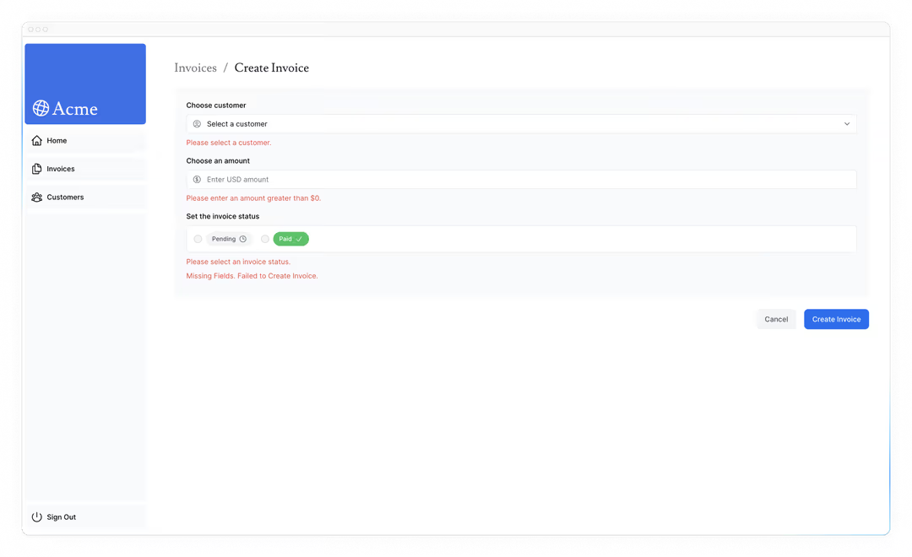

# 提升无障碍性

在上一章中，我们探讨了如何发现错误（包括 404 错误）并向用户展示备份。然而，我们还需要讨论另一块拼图：形式验证。让我们看看如何用 Server Actions 实现服务器端验证，以及如何用 React 的 [`useActionState`](https://react.dev/reference/react/useActionState) 钩子显示表单错误——同时考虑可访问性！

- 如何使用 `eslint-plugin-jsx-a11y` 配合 Next.js 来实现无障碍最佳实践。
- 如何实现服务器端表单验证。
- 如何使用 React 的 `useActionState` 钩子来处理表单错误，并向用户展示错误。

## 什么是无障碍性？

无障碍指的是设计和实施所有人都能使用的网络应用，包括残障人士。这是一个涵盖多个领域的广泛话题，比如键盘导航、语义 HTML、图片、颜色、视频等。

虽然本课程不会深入探讨无障碍，但我们将讨论 Next.js 可用的无障碍功能以及一些常见做法，以使您的应用更易接近。

> 如果您想了解更多关于无障碍的信息，我们推荐 [web.dev](https://web.dev/) 的 [“学习无障碍”](https://web.dev/learn/accessibility/)课程。

## 在 Next.js 中使用 ESLint 无障碍插件

Next.js 的 ESLint 配置包含 `eslint-plugin-jsx-a11y` 插件，有助于及早发现无障碍问题。例如，这个插件会警告图片中没有替代文本、错误使用 `aria-*` 和 `role`性等。

首先安装 ESLint：

```bash
pnpm add -D eslint eslint-config-next
```

接下来，在项目根创建一个包含以下内容的 `eslint.config.mjs` 文件：

```js
// eslint.config.mjs
import { defineConfig, globalIgnores } from "eslint/config";
import nextVitals from "eslint-config-next/core-web-vitals";

const eslintConfig = defineConfig([...nextVitals, globalIgnores([".next/**", "out/**", "build/**", "next-env.d.ts"])]);

export default eslintConfig;
```

现在在你的 `package.json` 文件中添加 `lint` 脚本：

```json
// /package.json

"scripts": {
    "build": "next build",
    "dev": "next dev",
    "start": "next start",
    "lint": "eslint ."
},
```

然后在终端里运行 `pnpm lint`：

```bash
pnpm lint
```

如果没有 linting 错误，ESLint 会在没有任何输出的情况下完成。但是，如果你有一张没有 `alt` 文本的图片，会发生什么？让我们来一探究竟！

去 `/app/ui/invoices/table.tsx` 把图片里的 `alt` prop 移除。你可以利用编辑的搜索功能快速找到 `<Image>`：

```tsx
// /app/ui/invoices/table.tsx

<Image
  src={invoice.image_url}
  className="rounded-full"
  width={28}
  height={28}
  alt={`${invoice.name}'s profile picture`} // Delete this line
/>
```

现在再次运行 `pnpm lint`，你应该会看到以下警告：

```shell

./app/ui/invoices/table.tsx
45:25  Warning: Image elements must have an alt prop,
either with meaningful text, or an empty string for decorative images. jsx-a11y/alt-text
```

虽然添加和配置 `linter` 不是必须的步骤，但在开发过程中发现无障碍问题会很有帮助。

## 提升表单可访问性

我们已经在做三件事来提升表单的无障碍性：

- 语义 HTML：使用语义元素（`<input>`、`<option>` 等）代替 `<div>`。这使得辅助技术（AT）能够专注于输入元素，向用户提供适当的上下文信息，使表格更易于导航和理解。
- 标签 ：包括 `<label>` 和 `htmlFor` 属性，确保每个表单字段都有描述性文本标签。这通过提供上下文提升了 AT 支持，同时也提升了用户点击标签聚焦对应输入字段的可用性。
- 对焦轮廓 ：场面经过适当设计，在对焦时显示轮廓。这对无障碍至关重要，因为它直观地显示页面上的活动元素，帮助键盘和屏幕阅读器用户理解自己在表单中的位置。你可以按 `Tab` 键来验证。
- 这些做法为让你的表单更容易被更多用户使用奠定了良好基础。不过，他们并没有解决**表单验证**和**错误**的问题。

## 形式验证

去 [http://localhost:3000/dashboard/invoices/create](http://localhost:3000/dashboard/invoices/create)，提交一个空白表格。会发生什么？

你会报错！这是因为你向服务器操作发送了空表单值。你可以通过在客户端或服务器上验证表单来防止这种情况。

## 客户端验证

有几种方法可以验证客户端的表单。最简单的方法是依赖浏览器提供的表单验证，在表单中的 `<input>` 和 `<select>` 元素中添加所需的属性。例如：

```tsx
// /app/ui/invoices/create-form.tsx

<input
  id="amount"
  name="amount"
  type="number"
  placeholder="Enter USD amount"
  className="peer block w-full rounded-md border border-gray-200 py-2 pl-10 text-sm outline-2 placeholder:text-gray-500"
  required
/>
```

请重新提交表单。如果你尝试提交空值表单，浏览器会显示警告。

这种方法通常没问题，因为有些 AT 支持浏览器验证。

客户端验证的替代方案是服务器端验证。接下来我们来看看如何实现它。现在，如果你添加了 `required` 属性，请删除它们。

## 服务端验证

通过在服务器上验证表单，你可以：

- 确保你的数据格式符合预期，再发送到数据库。
- 降低恶意用户绕过客户端验证的风险。
- 要有一个真实的来源来证明什么算是有效数据。

在你的 `create-form.tsx` 组件中，导入 react 的 `useActionState` 钩子。 由于 `useActionState` 是一个钩子，你需要用 `"use client"` 指令将表单转换成客户端组件：

```tsx
// /app/ui/invoices/create-form.tsx

"use client";

// ...
import { useActionState } from "react";
```

在你的表单组件中，`useActionState` 钩子：

- 取两个参数：`(action, initialState)`。
- 返回两个值：`[state， formAction]`——表单状态，以及提交表单时调用的函数

将你的 `createInvoice` 操作作为 `useActionState` 的参数传递，在你的`<form action={}>` 属性内调用 `formAction`。

```tsx
// /app/ui/invoices/create-form.tsx

// ...
import { useActionState } from "react";

export default function Form({ customers }: { customers: CustomerField[] }) {
  const [state, formAction] = useActionState(createInvoice, initialState);

  return <form action={formAction}>...</form>;
}
```

`initialState` 可以是你定义的任何东西，在这里，创建一个带有两个空键的对象：`message` 和 `errors`，并从 `actions.ts` 文件导入 `State` 类型。`State` 尚未存在，但我们接下来会创建它：

```tsx
// /app/ui/invoices/create-form.tsx

// ...
import { createInvoice, State } from "@/app/lib/actions";
import { useActionState } from "react";

export default function Form({ customers }: { customers: CustomerField[] }) {
  const initialState: State = { message: null, errors: {} };
  const [state, formAction] = useActionState(createInvoice, initialState);

  return <form action={formAction}>...</form>;
}
```

这起初可能让人困惑，但一旦你更新服务器操作，就会更清楚。我们现在就这么做。

在你的 `action.ts` 文件中，你可以用 `Zod` 来验证表单数据。更新您的 `FormSchema` 如下：

```ts
// /app/lib/actions.ts
const FormSchema = z.object({
  id: z.string(),
  customerId: z.string({
    invalid_type_error: "Please select a customer.",
  }),
  amount: z.coerce.number().gt(0, { message: "Please enter an amount greater than $0." }),
  status: z.enum(["pending", "paid"], {
    invalid_type_error: "Please select an invoice status.",
  }),
  date: z.string(),
});
```

-` customerId`——如果客户字段为空，Zod 已经会抛出错误，因为它期望有一个类型字符串 。但如果用户没有选择客户，我们就添加一条友好的消息。

- `amount` ——由于你是从字符串强制金额类型到数字 ，如果字符串为空，金额默认为零。告诉 Zod，我们总是希望用 `.gt()` 函数让值大于 0。
- `status` - 如果状态字段为空，Zod 会抛出错误，因为它预期是 `'pending'`或 `'paid'`。如果用户没有选择状态，我们也应该添加友好消息。

接下来，更新你的 `createInvoice` 操作，接受两个参数——`prevState` 和 `formData`：

```ts
export type State = {
  errors?: {
    customerId?: string[];
    amount?: string[];
    status?: string[];
  };
  message?: string | null;
};

export async function createInvoice(prevState: State, formData: FormData) {
  // ...
}
```

- `formData`——和以前一样。
- `prevState` - 包含从 `useActionState` 钩子传递的状态。你在这个例子中不会用到它，但它是必需的道具。

然后，将 Zod 解析函数改为 `safeParse()`：

```ts
// /app/lib/actions.ts

export async function createInvoice(prevState: State, formData: FormData) {
  // Validate form fields using Zod
  const validatedFields = CreateInvoice.safeParse({
    customerId: formData.get("customerId"),
    amount: formData.get("amount"),
    status: formData.get("status"),
  });

  // ...
}
```

`safeParse()` 会返回包含 `success` 或 `error`字段的对象。这样可以更优雅地处理验证，而不必把这个逻辑放进 `try/catch` 的模块里。

在将信息发送到数据库前，请检查表单字段是否已正确验证并附带条件：

```ts
// /app/lib/actions.ts

export async function createInvoice(prevState: State, formData: FormData) {
  // Validate form fields using Zod
  const validatedFields = CreateInvoice.safeParse({
    customerId: formData.get("customerId"),
    amount: formData.get("amount"),
    status: formData.get("status"),
  });

  // If form validation fails, return errors early. Otherwise, continue.
  if (!validatedFields.success) {
    return {
      errors: validatedFields.error.flatten().fieldErrors,
      message: "Missing Fields. Failed to Create Invoice.",
    };
  }

  // ...
}
```

如果 `validdFields`未成功，我们会提前返回该函数并接收 Zod 的错误消息。

最后，既然你是单独处理表单验证，不在 try/catch 区块之外，你可以针对数据库错误返回特定消息，最终代码应该是这样：

```ts
// /app/lib/actions.ts

export async function createInvoice(prevState: State, formData: FormData) {
  // Validate form using Zod
  const validatedFields = CreateInvoice.safeParse({
    customerId: formData.get("customerId"),
    amount: formData.get("amount"),
    status: formData.get("status"),
  });

  // If form validation fails, return errors early. Otherwise, continue.
  if (!validatedFields.success) {
    return {
      errors: validatedFields.error.flatten().fieldErrors,
      message: "Missing Fields. Failed to Create Invoice.",
    };
  }

  // Prepare data for insertion into the database
  const { customerId, amount, status } = validatedFields.data;
  const amountInCents = amount * 100;
  const date = new Date().toISOString().split("T")[0];

  // Insert data into the database
  try {
    await sql`
      INSERT INTO invoices (customer_id, amount, status, date)
      VALUES (${customerId}, ${amountInCents}, ${status}, ${date})
    `;
  } catch (error) {
    // If a database error occurs, return a more specific error.
    return {
      message: "Database Error: Failed to Create Invoice.",
    };
  }

  // Revalidate the cache for the invoices page and redirect the user.
  revalidatePath("/dashboard/invoices");
  redirect("/dashboard/invoices");
}
```

很好，现在让我们展示表单组件中的错误。回到 `create-form.tsx` 组件中，你可以用 form `state` 访问错误。

添加一个三元操作符来检查每个具体错误。例如，在客户字段之后，你可以添加：

```tsx
// /app/ui/invoices/create-form.tsx

<form action={formAction}>
  <div className="rounded-md bg-gray-50 p-4 md:p-6">
    {/* Customer Name */}
    <div className="mb-4">
      <label htmlFor="customer" className="mb-2 block text-sm font-medium">
        Choose customer
      </label>
      <div className="relative">
        <select
          id="customer"
          name="customerId"
          className="peer block w-full rounded-md border border-gray-200 py-2 pl-10 text-sm outline-2 placeholder:text-gray-500"
          defaultValue=""
          aria-describedby="customer-error"
        >
          <option value="" disabled>
            Select a customer
          </option>
          {customers.map((name) => (
            <option key={name.id} value={name.id}>
              {name.name}
            </option>
          ))}
        </select>
        <UserCircleIcon className="pointer-events-none absolute left-3 top-1/2 h-[18px] w-[18px] -translate-y-1/2 text-gray-500" />
      </div>
      <div id="customer-error" aria-live="polite" aria-atomic="true">
        {state.errors?.customerId &&
          state.errors.customerId.map((error: string) => (
            <p className="mt-2 text-sm text-red-500" key={error}>
              {error}
            </p>
          ))}
      </div>
    </div>
    // ...
  </div>
</form>
```

> 提示： 你可以在元件内部进行 state console.log，检查所有线路是否正确。在开发工具里检查控制台，因为你的表单现在是客户端组件。

在上面的代码中，你还添加了以下 aria labels：

- `aria-describedby="customer-error"` ：这建立了选择元素与错误消息容器之间的关系。它表示 `id=“customer-error”` 的容器描述了 `select` 元素。当用户操作选择框以通知错误时，屏幕阅读器会阅读该描述。
- `id=“customer-error”`：该 id 属性唯一标识包含 `select` 输入错误消息的 HTML 元素。这对于建立关系是 `aria-dedescribdby`所必需的。
- `aria-live=“polite”`：屏幕阅读器应礼貌地通知用户，当 `div` 内的错误被更新时。当内容发生变化（例如用户纠正错误时），屏幕阅读器会在用户空闲时宣布这些变化，以避免中断内容。

## 练习：添加 aria labels

以上述例子为例，在剩余的表单字段中添加错误。如果缺少字段，你也应该在表单底部显示一条信息。你的界面应该是这样的：



准备好后，运行 `pnpm lint` 检查你是否正确使用了 aria 标签。

如果你想挑战自己，可以将本章学到的知识结合到 `edit-form.tsx` 组件中加入表单验证。

你需要:

- 在你的 `edit-form.tsx` 组件中添加 `useActionState`。
- 编辑 `updateInvoice` 操作以处理 Zod 的验证错误。
- 在组件中显示错误，并添加 aria 标签以提高无障碍性。

准备好后，展开下面的代码片段查看解决方案：

编辑 invoice 表格：

```tsx
// /app/ui/invoices/edit-form.tsx
// ...
import { updateInvoice, State } from "@/app/lib/actions";
import { useActionState } from "react";

export default function EditInvoiceForm({ invoice, customers }: { invoice: InvoiceForm; customers: CustomerField[] }) {
  const initialState: State = { message: null, errors: {} };
  const updateInvoiceWithId = updateInvoice.bind(null, invoice.id);
  const [state, formAction] = useActionState(updateInvoiceWithId, initialState);

  return <form action={formAction}>{/* ... */}</form>;
}
```

服务器操作：

```ts
// /app/lib/actions.ts
export async function updateInvoice(id: string, prevState: State, formData: FormData) {
  const validatedFields = UpdateInvoice.safeParse({
    customerId: formData.get("customerId"),
    amount: formData.get("amount"),
    status: formData.get("status"),
  });

  if (!validatedFields.success) {
    return {
      errors: validatedFields.error.flatten().fieldErrors,
      message: "Missing Fields. Failed to Update Invoice.",
    };
  }

  const { customerId, amount, status } = validatedFields.data;
  const amountInCents = amount * 100;

  try {
    await sql`
      UPDATE invoices
      SET customer_id = ${customerId}, amount = ${amountInCents}, status = ${status}
      WHERE id = ${id}
    `;
  } catch (error) {
    return { message: "Database Error: Failed to Update Invoice." };
  }

  revalidatePath("/dashboard/invoices");
  redirect("/dashboard/invoices");
}
```

[下一章](./第十四章.md)
