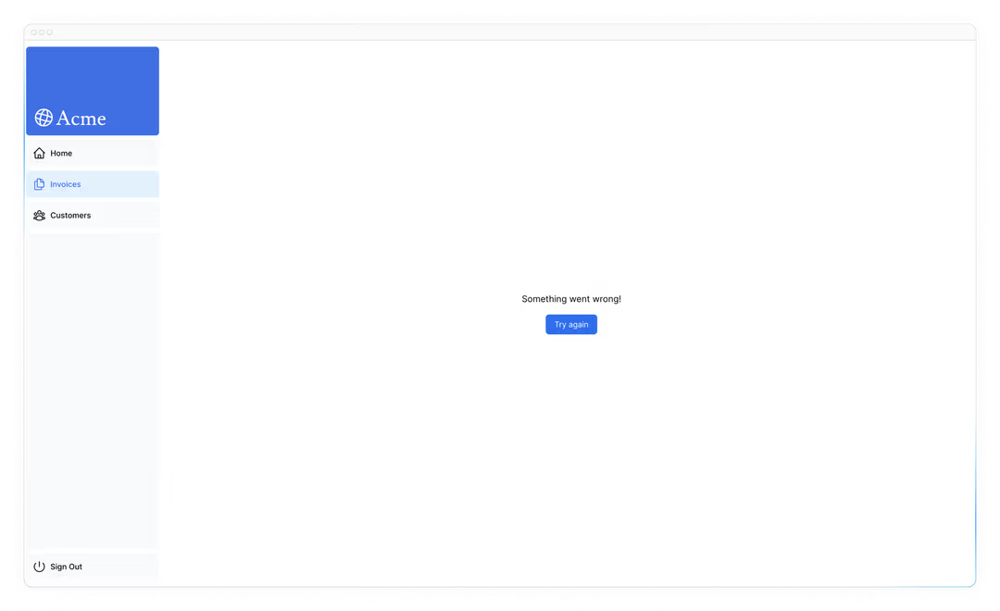
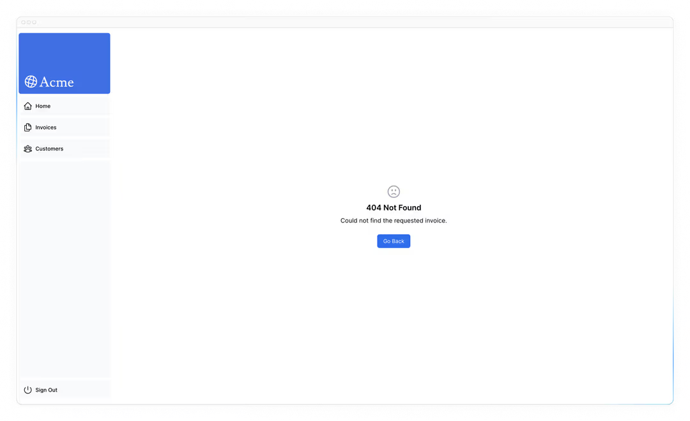

# 处理错误

在上一章中，你学会了如何利用服务器动作来变换数据。让我们看看你如何优雅地处理错误， 比如 JavaScript 的 try/catch 语句和 Next.js 未捕获异常的 API。

- 如何使用特殊的 `error.tsx` 文件捕捉路由段中的错误，并向用户展示备用界面。
- 如何使用 `notFound` 函数和 `not-found` 文件来处理 404 错误（针对不存在的资源）。

## 在服务器操作中添加 `try/catch`

首先，让我们在服务器操作中加入 JavaScript 的 `try/catch` 语句，这样你就能优雅地处理错误。

如果你知道如何操作，花几分钟更新你的服务器操作，或者复制下面的代码：

```ts
// /app/lib/actions.ts

export async function createInvoice(formData: FormData) {
  const { customerId, amount, status } = CreateInvoice.parse({
    customerId: formData.get("customerId"),
    amount: formData.get("amount"),
    status: formData.get("status"),
  });

  const amountInCents = amount * 100;
  const date = new Date().toISOString().split("T")[0];

  try {
    await sql`
      INSERT INTO invoices (customer_id, amount, status, date)
      VALUES (${customerId}, ${amountInCents}, ${status}, ${date})
    `;
  } catch (error) {
    // We'll also log the error to the console for now
    console.error(error);
    return {
      message: "Database Error: Failed to Create Invoice.",
    };
  }

  revalidatePath("/dashboard/invoices");
  redirect("/dashboard/invoices");
}
```

```ts
// /app/lib/actions.ts
export async function updateInvoice(id: string, formData: FormData) {
  const { customerId, amount, status } = UpdateInvoice.parse({
    customerId: formData.get("customerId"),
    amount: formData.get("amount"),
    status: formData.get("status"),
  });

  const amountInCents = amount * 100;

  try {
    await sql`
        UPDATE invoices
        SET customer_id = ${customerId}, amount = ${amountInCents}, status = ${status}
        WHERE id = ${id}
      `;
  } catch (error) {
    // We'll also log the error to the console for now
    console.error(error);
    return { message: "Database Error: Failed to Update Invoice." };
  }

  revalidatePath("/dashboard/invoices");
  redirect("/dashboard/invoices");
}
```

注意 `redirect` 是在 `try/catch` 阻挡之外被调用的。这是因为 `redirect` 通过抛出错误来实现，而 `catch` 块会捕捉到错误。为了避免这种情况，你可以在 `try/catch` 后 调用 `redirect` 。只有在 try 成功时， `redirect` 才能被访问。

我们通过发现数据库问题并从服务器操作中返回有用的信息，优雅地处理这些错误。

如果你的 action 中存在未被捕获的例外情况，会发生什么？我们可以通过手动抛出错误来模拟。例如，在 `deleteInvoice` 操作中，在函数顶部抛出错误：

```ts
// /app/lib/actions.ts
export async function deleteInvoice(id: string) {
  throw new Error("Failed to Delete Invoice");

  // Unreachable code block
  await sql`DELETE FROM invoices WHERE id = ${id}`;
  revalidatePath("/dashboard/invoices");
}
```

当你尝试删除 invoice 时，你应该会在 localhost 上看到错误。进入生产环境时，当发生意外时，你希望更优雅地向用户展示一条信息。

这就是 Next.js [`error.tsx`](https://nextjs.org/docs/app/api-reference/file-conventions/error) 文件的作用。测试后且进入下一部分前，确保删除这个手动添加的错误。

## 用 `error.tsx` 处理所有错误

`error.tsx` 文件可用于定义路由段的界面边界。它作为处理意外错误的万能工具，并允许你向用户展示一个备用界面。

在你的 `/dashboard/invoices` 文件夹里，创建一个名为 `error.tsx` 的新文件，粘贴以下代码：

```tsx
// /dashboard/invoices/error.tsx

"use client";

import { useEffect } from "react";

export default function Error({ error, reset }: { error: Error & { digest?: string }; reset: () => void }) {
  useEffect(() => {
    // Optionally log the error to an error reporting service
    console.error(error);
  }, [error]);

  return (
    <main className="flex h-full flex-col items-center justify-center">
      <h2 className="text-center">Something went wrong!</h2>
      <button
        className="mt-4 rounded-md bg-blue-500 px-4 py-2 text-sm text-white transition-colors hover:bg-blue-400"
        onClick={
          // Attempt to recover by trying to re-render the invoices route
          () => reset()
        }
      >
        Try again
      </button>
    </main>
  );
}
```

你会注意到上述代码的一些特点：

- "use client"-- `error.tsx` 需要是客户端组件
- 接受两个 props:
  - error: 该对象是 JavaScript 原生 [Error](https://developer.mozilla.org/en-US/docs/Web/JavaScript/Reference/Global_Objects/Error) 对象的一个实例。
  - reset: 这是一个重置误差边界的功能。执行后，函数会尝试重新渲染路由段。

当你再次尝试删除 invoices 时，你应该会看到以下界面：



## 使用 `notFound` 函数处理 404 错误

另一种优雅处理错误的方法是使用 `notFound` 函数。虽然 `error.tsx` 适合捕捉未捕获的异常，但 `notFound` 也可以用于获取不存在的资源。

例如，访问 [http://localhost:3000/dashboard/invoices/2e94d1ed-d220-449f-9f11-f0bbceed9645/edit](http://localhost:3000/dashboard/invoices/2e94d1ed-d220-449f-9f11-f0bbceed9645/edit)。

这是一个不存在于你数据库中的假 UUID。

你会立刻看到 `error.tsx` 生效，因为这是 `/invoices` 的一个子路由，其中 `error.tsx` 是被定义的。

不过，如果你想更具体一点，可以显示404错误，告诉用户他们试图访问的资源尚未被找到。

您可以通过 `data.ts` 中的 `fetchInvoiceById` 函数，并添加退回 invoices 的控制台日志来确认该资源未被找到：

```ts
// /app/lib/data.ts

export async function fetchInvoiceById(id: string) {
  try {
    // ...

    console.log(invoice); // Invoice is an empty array []
    return invoice[0];
  } catch (error) {
    console.error("Database Error:", error);
    throw new Error("Failed to fetch invoice.");
  }
}
```

既然你知道 invoice 不存在数据库，我们就用 `notFound` 来处理它。导航到 `/dashboard/invoices/[id]/edit/page.tsx` ，并从 `"next/navigation"` 导入 `{ notFound }`。

然后，如果 invoke 不存在，你可以用条件句调用 `notFound`：

```tsx
// /dashboard/invoices/[id]/edit/page.tsx

import { fetchInvoiceById, fetchCustomers } from "@/app/lib/data";
import { notFound } from "next/navigation";

export default async function Page(props: { params: Promise<{ id: string }> }) {
  const params = await props.params;
  const id = params.id;
  const [invoice, customers] = await Promise.all([fetchInvoiceById(id), fetchCustomers()]);

  if (!invoice) {
    notFound();
  }

  // ...
}
```

然后，为了向用户展示错误界面，可以在 `/edit` 文件夹内创建一个 `not-found.tsx` 文件。

在 `not-found.tsx` 文件中，粘贴以下代码：

```tsx
// /dashboard/invoices/[id]/edit/not-found.tsx

import Link from "next/link";
import { FaceFrownIcon } from "@heroicons/react/24/outline";

export default function NotFound() {
  return (
    <main className="flex h-full flex-col items-center justify-center gap-2">
      <FaceFrownIcon className="w-10 text-gray-400" />
      <h2 className="text-xl font-semibold">404 Not Found</h2>
      <p>Could not find the requested invoice.</p>
      <Link href="/dashboard/invoices" className="mt-4 rounded-md bg-blue-500 px-4 py-2 text-sm text-white transition-colors hover:bg-blue-400">
        Go Back
      </Link>
    </main>
  );
}
```

刷新路线后，你应该会看到以下界面：



这点需要记住，`notFound` 会优先于 `error.tsx`，所以当你需要处理更具体的错误时，可以联系它！

## 延伸阅读

想了解更多关于 Next.js 错误处理的信息，请查看以下文档：

- [Error Handling](https://nextjs.org/docs/app/building-your-application/routing/error-handling)
- [`error.js` API 参考](https://nextjs.org/docs/app/api-reference/file-conventions/error)
- [`notFound()` API 参考](https://nextjs.org/docs/app/api-reference/functions/not-found)
- [`not-found.js` API 参考](https://nextjs.org/docs/app/api-reference/file-conventions/not-found)

[下一章](./第十三章.md)
