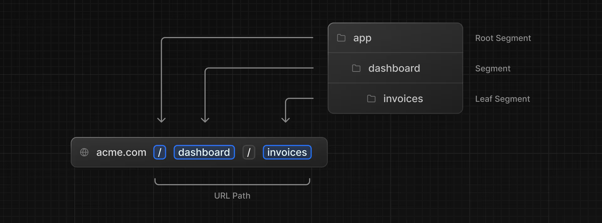
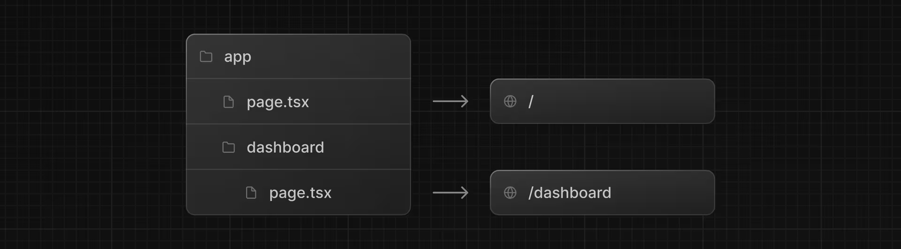
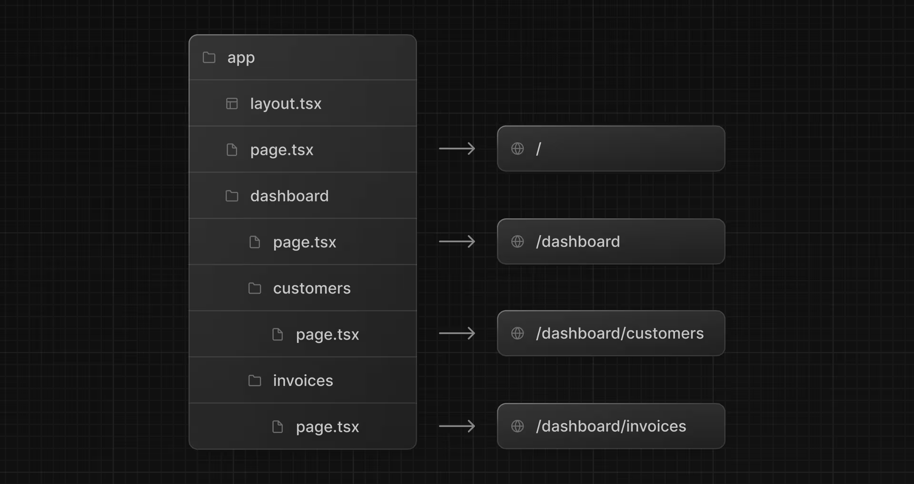
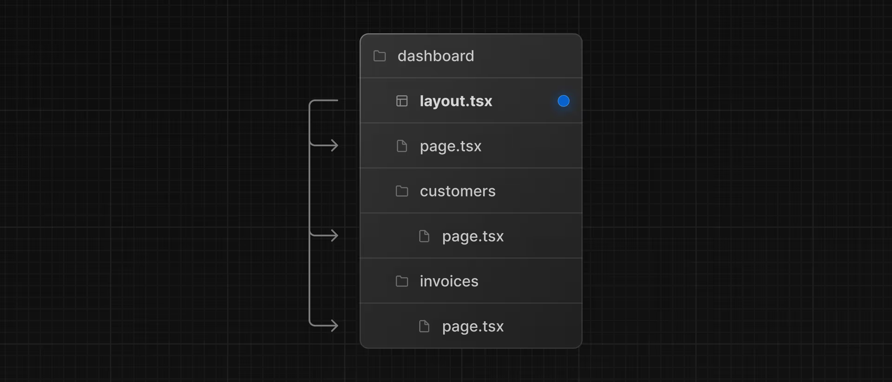
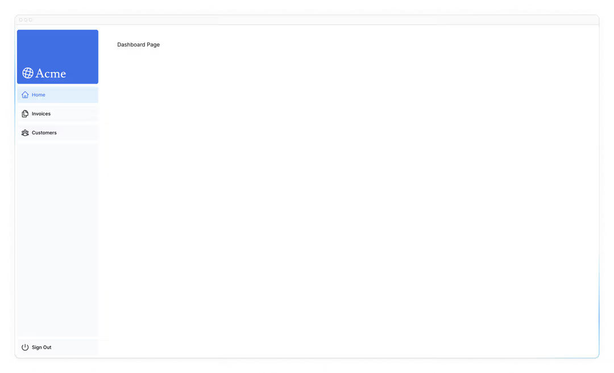
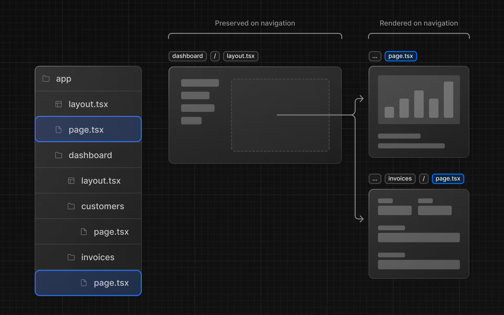

# 创建布局和页面

到目前为止，你的应用程序只有一个主页。让我们来学习如何使用布局和页面创建更多路由。

- 使用文件系统路由创建 `dashboard` 路由。
- 了解在创建新的路由段时文件夹和文件的作用。
- 创建一个可在多个 dashboard 页面之间共享的嵌套布局。
- 了解什么是托管、部分渲染和根布局。

## 嵌套路由

Next.js 采用文件系统路由，其中文件夹用于创建嵌套路由。每个文件夹代表一个路由段，该路由段映射到一个 URL 段。



你可以使用 `layout.tsx` 和 `page.tsx` 文件为每个路由创建单独的用户界面。

`page.tsx` 是一个特殊的 Next.js 文件，它会导出一个 React 组件，并且是路由可访问所必需的。在你的应用程序中，已经有一个页面文件：`/app/page.tsx` ——这是与路由 `/` 相关联的主页。

要创建嵌套路由，你可以将文件夹相互嵌套，并在其中添加 `page.tsx` 文件。例如：



`/app/dashboard/page.tsx` 与 `/dashboard` 路径相关联。让我们创建这个页面来看看它是如何工作的！

## 创建 dashboard 页面

在 `/app`目录下创建一个名为 `dashboard` 的新文件夹。然后，在 `dashboard` 文件夹中创建一个新的 `page.tsx` 文件，内容如下：

```tsx
// /app/dashboard/page.tsx

export default function Page() {
  return <p>Dashboard Page</p>;
}
```

现在，请确保开发服务器正在运行，然后访问 [http://localhost:3000/dashboard](http://localhost:3000/dashboard) 。你应该会看到 “Dashboard Page” 文本。

以下是在 Next.js 中创建不同页面的方法：使用文件夹创建新的路由段，并在其中添加一个页面文件。

通过为页面文件设置特殊名称，Next.js 允许你将 UI 组件、测试文件和其他相关代码与路由[放在一起](https://nextjs.org/docs/app/getting-started/project-structure#colocation) 。只有页面文件内的内容会公开可访问。例如，`/ui` 和 `/lib` 文件夹与你的路由一起放在 `/app` 文件夹内。

## 练习：创建 dashboard 页面

让我们练习创建更多的路由。在你的 dashboard 中，再创建两个页面：

1. **Customers Page**：该页面可在 [http://localhost:3000/dashboard/customers](http://localhost:3000/dashboard/customers) 访问。目前，它应返回一个 `<p>客户页面</p>` 元素。
2. **Invoices Page**: invoices 页面应可通过 [http://localhost:3000/dashboard/invoices](http://localhost:3000/dashboard/invoices) 访问。目前，还需返回一个 `<p>发票页面</p>` 元素。

花些时间解决这个练习，准备好后，展开下面的切换按钮查看答案：

你应该拥有以下文件夹结构：


**Customers 页面:**

```tsx
// /app/dashboard/customers/page.tsx

export default function Page() {
  return <p>Customers Page</p>;
}
```

**Invoices 页面:**

```tsx
// /app/dashboard/invoices/page.tsx

export default function Page() {
  return <p>Invoices Page</p>;
}
```

## 创建 dashboard 布局

Dashboards 有某种可在多个页面间共享的导航功能。在 Next.js 中，你可以使用一个特殊的 `layout.tsx` 文件来创建可在多个页面间共享的用户界面。让我们为 dashboard 页面创建一个布局吧！

在 `/dashboard` 文件夹内，添加一个名为 `layout.tsx` 的新文件，并粘贴以下代码：

```tsx
// /app/dashboard/layout.tsx

import SideNav from "@/app/ui/dashboard/sidenav";

export default function Layout({ children }: { children: React.ReactNode }) {
  return (
    <div className="flex h-screen flex-col md:flex-row md:overflow-hidden">
      <div className="w-full flex-none md:w-64">
        <SideNav />
      </div>
      <div className="grow p-6 md:overflow-y-auto md:p-12">{children}</div>
    </div>
  );
}
```

这段代码中发生了几件事，我们来逐步分析一下：

首先，你要将 `<SideNav />` 组件导入到你的布局中。任何导入到这个文件中的组件都将成为布局的一部分。

`<Layout />` 组件接收一个 `children` 属性。这个子元素可以是一个页面，也可以是另一个布局。就你的情况而言，`/dashboard` 目录下的页面会自动嵌套在 `<Layout />` 中，如下所示：



通过保存更改并检查本地主机来确认所有内容都能正常运行。你应该会看到以下内容：



在 Next.js 中使用布局的一个好处是，在导航时，只有页面组件会更新，而布局不会重新渲染。这被称为[部分渲染](https://nextjs.org/docs/app/getting-started/linking-and-navigating#4-partial-rendering)，它在页面之间切换时会保留布局中的客户端 React 状态。



## 根布局

在第三章中，你将 `Inter` 字体导入了另一个布局：`/app/layout.tsx` 。提醒一下：

```tsx
// /app/layout.tsx

import "@/app/ui/global.css";
import { inter } from "@/app/ui/fonts";

export default function RootLayout({ children }: { children: React.ReactNode }) {
  return (
    <html lang="en">
      <body className={`${inter.className} antialiased`}>{children}</body>
    </html>
  );
}
```

这被称为[根布局](https://nextjs.org/docs/app/api-reference/file-conventions/layout#root-layouts)，是每个 Next.js 应用程序都必需的。你添加到根布局中的任何用户界面都将在应用程序的所有页面中共享。你可以使用根布局来修改 `<html>` 和 `<body>` 标签，并添加元数据（你将在[后面的章节](https://nextjs.org/learn/dashboard-app/adding-metadata)中了解更多关于元数据的内容）。

由于你刚刚创建的新布局（`/app/dashboard/layout.tsx`）是 dashboard 页面独有的，因此你无需在上方的根布局中添加任何用户界面。

[下一章](./第五章.md)
